# 📊 Eco Balance Documentation Structure - Visual Guide

**Version:** 1.0.0  
**Created:** October 25, 2025  
**Purpose:** Visual representations of documentation structure and relationships

---

## 🗂️ Overall Directory Structure

```
eco restoration project/
│
├── 📄 VERSION                          # Current: 1.0.0
├── 📄 CHANGELOG.md                     # Complete version history
├── 📄 00_Eco_Balance_Hub.md            # 🏠 START HERE - Main navigation
├── 📄 QUICK_REFERENCE_GUIDE.md         # How to use documentation
├── 📄 STRUCTURE_VISUAL_GUIDE.md        # This file - visual diagrams
│
├── 📄 Strategic Documents (22 files)   # Numbered 01-70
│   ├── 📄 01-04: Core Strategy        # Vision, mission, status
│   ├── 📄 10-13: Organization         # Structure, governance, legal
│   ├── 📄 20-22: Technical            # Methodology, technology
│   ├── 📄 30-32: Financial            # Business model, funding
│   ├── 📄 40-44: Implementation       # Expansion, operations, next steps
│   ├── 📄 50-51: Risk & Performance   # Risks, KPIs
│   ├── 📄 60: Marketing               # Communications strategy
│   └── 📄 70: Reference               # Case studies
│
├── 📁 implementation_tasks/            # 44 detailed execution guides
│   ├── 📄 README.md                   # Hub for all task categories
│   ├── 📁 site_selection/            # 9 files (00-08)
│   ├── 📁 reforestation/             # 7 files (00-06)
│   ├── 📁 biodiversity/              # 7 files (00-06)
│   ├── 📁 soil_restoration/          # 7 files (00-06)
│   ├── 📁 water_management/          # 7 files (00-06)
│   └── 📁 community_engagement/      # 7 files (00-06)
│
├── 📁 _versions/                      # Version control artifacts
│   ├── 📄 README.md                  # Version system guide
│   └── 📁 v1.0.0/                   # Current version artifacts
│       ├── 📄 RELEASE_NOTES.md      # What's in v1.0.0
│       └── 📁 reports/              # Version-specific reports
│           ├── 📄 completion_report.md
│           ├── 📄 integration_status.md
│           └── 📄 documentation_manifest.md
│
├── 📁 _process/                       # Development documentation
│   ├── 📄 README.md                  # Process documentation guide
│   ├── 📁 integration/               # 4 integration documents
│   ├── 📁 migration/                 # 2 migration documents
│   ├── 📁 sessions/                  # Session summaries
│   └── 📁 refactoring/               # Refactoring decisions
│
├── 📁 _templates/                     # Templates for consistency
│   ├── 📄 strategic_document_template.md
│   ├── 📄 implementation_task_template.md
│   ├── 📄 release_notes_template.md
│   └── 📄 changelog_entry_template.md
│
└── 📁 archive/                        # Historical documents
    ├── 📄 Original comprehensive plans
    └── 📁 _process_history/          # Old process documents
```

---

## 🎯 Content Organization Map

```mermaid
graph TB
    Hub[00_Eco_Balance_Hub.md<br/>MAIN NAVIGATION]
    
    Strategy[Strategic Documents<br/>01-70]
    Tasks[Implementation Tasks<br/>44 files in 6 categories]
    Version[Version Control<br/>VERSION, CHANGELOG]
    Support[Supporting Resources<br/>_versions, _process, _templates]
    
    Hub --> Strategy
    Hub --> Tasks
    Hub --> Version
    Hub --> Support
    
    Strategy --> Core[Core Strategy<br/>01-04]
    Strategy --> Org[Organization<br/>10-13]
    Strategy --> Tech[Technical<br/>20-22]
    Strategy --> Finance[Financial<br/>30-32]
    Strategy --> Impl[Implementation<br/>40-44]
    Strategy --> Risk[Risk & KPIs<br/>50-51]
    Strategy --> Market[Marketing<br/>60]
    Strategy --> Ref[Reference<br/>70]
    
    Tasks --> Site[Site Selection<br/>9 files]
    Tasks --> Forest[Reforestation<br/>7 files]
    Tasks --> Bio[Biodiversity<br/>7 files]
    Tasks --> Soil[Soil Restoration<br/>7 files]
    Tasks --> Water[Water Management<br/>7 files]
    Tasks --> Community[Community Engagement<br/>7 files]
    
    Version --> VerFile[VERSION file<br/>1.0.0]
    Version --> Change[CHANGELOG.md<br/>History]
    Version --> VerDir[_versions/<br/>Artifacts]
    
    Support --> Process[_process/<br/>Development docs]
    Support --> Templates[_templates/<br/>Templates]
    Support --> Archive[archive/<br/>Historical]
    
    style Hub fill:#4CAF50,stroke:#2E7D32,color:#fff
    style Strategy fill:#2196F3,stroke:#1565C0,color:#fff
    style Tasks fill:#FF9800,stroke:#E65100,color:#fff
    style Version fill:#9C27B0,stroke:#6A1B9A,color:#fff
    style Support fill:#607D8B,stroke:#37474F,color:#fff
```

---

## 🚀 Navigation Flow

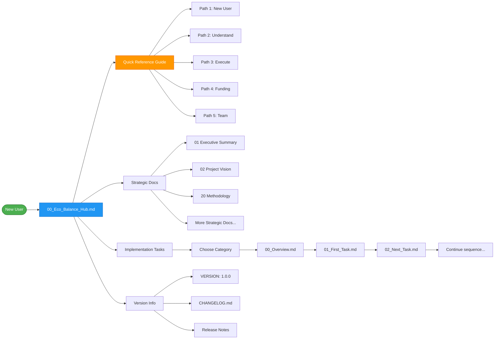

---

## 🔄 Version Control Workflow

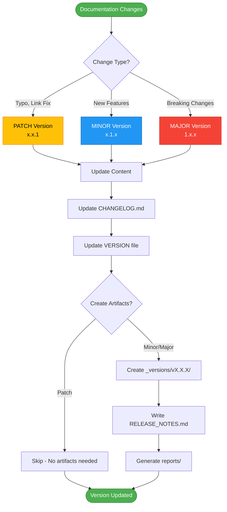

---

## 📚 Strategic Documents Hierarchy

```mermaid
graph TD
    Hub[00_Eco_Balance_Hub<br/>Central Navigation]
    
    Hub --> Strategy[CORE STRATEGY<br/>01-04]
    Hub --> Org[ORGANIZATION<br/>10-13]
    Hub --> Tech[TECHNICAL<br/>20-22]
    Hub --> Finance[FINANCIAL<br/>30-32]
    Hub --> Impl[IMPLEMENTATION<br/>40-44]
    Hub --> Risk[RISK & KPIs<br/>50-51]
    Hub --> Market[MARKETING<br/>60]
    Hub --> Case[CASE STUDIES<br/>70]
    
    Strategy --> S1[01 Executive Summary]
    Strategy --> S2[02 Project Vision]
    Strategy --> S3[03 Success Factors]
    Strategy --> S4[04 Current Status]
    
    Org --> O1[10 Organizational Structure]
    Org --> O2[11 Governance]
    Org --> O3[12 Team Roles]
    Org --> O4[13 Legal Framework]
    
    Tech --> T1[20 Restoration Methodology]
    Tech --> T2[21 Technology Integration]
    Tech --> T3[22 Challenges & Solutions]
    
    Finance --> F1[30 Business Model]
    Finance --> F2[32 Funding Strategy]
    
    Impl --> I1[40 Expansion Strategy]
    Impl --> I2[42 Next 90 Days]
    Impl --> I3[43 Operations Plan]
    Impl --> I4[44 Site Selection]
    
    Risk --> R1[50 Risk Assessment]
    Risk --> R2[51 KPIs]
    
    Market --> M1[60 Marketing Strategy]
    
    Case --> C1[70 Case Studies]
    
    style Hub fill:#4CAF50,stroke:#2E7D32,color:#fff
    style Strategy fill:#2196F3,stroke:#1565C0,color:#fff
    style Org fill:#9C27B0,stroke:#6A1B9A,color:#fff
    style Tech fill:#FF9800,stroke:#E65100,color:#fff
    style Finance fill:#4CAF50,stroke:#2E7D32,color:#fff
    style Impl fill:#F44336,stroke:#C62828,color:#fff
    style Risk fill:#FFC107,stroke:#F57F17,color:#000
    style Market fill:#00BCD4,stroke:#00838F,color:#fff
    style Case fill:#607D8B,stroke:#37474F,color:#fff
```

---

## 🌳 Implementation Tasks Structure

```mermaid
graph TB
    TaskHub[implementation_tasks/<br/>README.md]
    
    TaskHub --> Site[site_selection/<br/>9 files]
    TaskHub --> Forest[reforestation/<br/>7 files]
    TaskHub --> Bio[biodiversity/<br/>7 files]
    TaskHub --> Soil[soil_restoration/<br/>7 files]
    TaskHub --> Water[water_management/<br/>7 files]
    TaskHub --> Comm[community_engagement/<br/>7 files]
    
    Site --> S00[00_Overview.md]
    Site --> S01[01_Identify_Locations]
    Site --> S02[02_Evaluate_Condition]
    Site --> S03[03_Estimate_Potential]
    Site --> S04[04_Consider_Accessibility]
    Site --> S05[05_Research_Regulations]
    Site --> S06[06_Contact_Landowners]
    Site --> S07[07_Visit_Sites]
    Site --> S08[08_Make_Shortlist]
    
    Forest --> F00[00_Overview.md]
    Forest --> F01[01_Identify_Species]
    Forest --> F0N[02-06 More tasks...]
    
    Bio --> B00[00_Overview.md]
    Bio --> B01[01_Assess_Biodiversity]
    Bio --> B0N[02-06 More tasks...]
    
    Soil --> So00[00_Overview.md]
    Soil --> So01[01_Assess_Soil_Health]
    Soil --> So0N[02-06 More tasks...]
    
    Water --> W00[00_Overview.md]
    Water --> W01[01_Assess_Water_Needs]
    Water --> W0N[02-06 More tasks...]
    
    Comm --> C00[00_Overview.md]
    Comm --> C01[01_Identify_Stakeholders]
    Comm --> C0N[02-06 More tasks...]
    
    style TaskHub fill:#FF9800,stroke:#E65100,color:#fff
    style Site fill:#2196F3,stroke:#1565C0,color:#fff
    style Forest fill:#4CAF50,stroke:#2E7D32,color:#fff
    style Bio fill:#8BC34A,stroke:#558B2F,color:#fff
    style Soil fill:#795548,stroke:#4E342E,color:#fff
    style Water fill:#00BCD4,stroke:#00838F,color:#fff
    style Comm fill:#9C27B0,stroke:#6A1B9A,color:#fff
```

---

## 🏗️ Meta Structure (_directories)

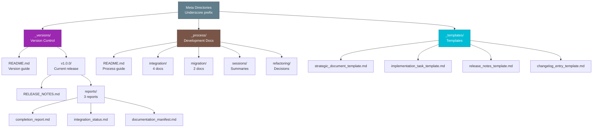

---

## 🔗 Cross-Reference Network

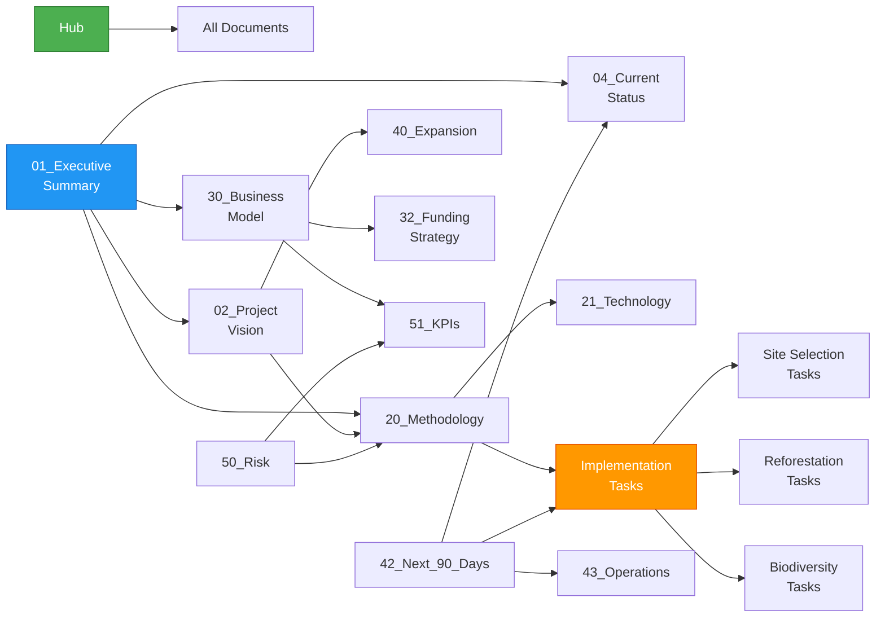

---

## 📊 File Count Breakdown

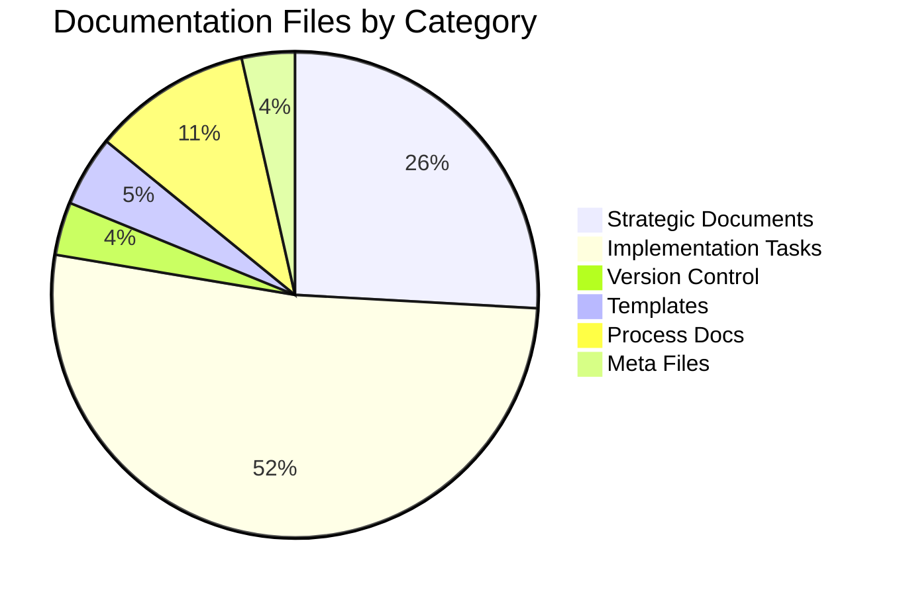

---

## 🎯 User Journey Maps

### Journey 1: New User Discovery

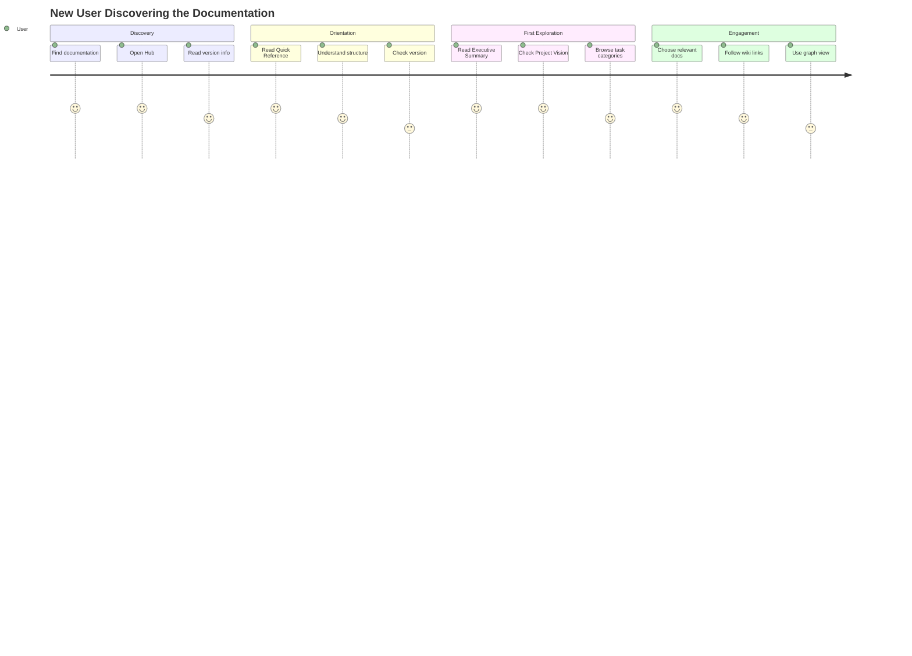

### Journey 2: Team Member Execution

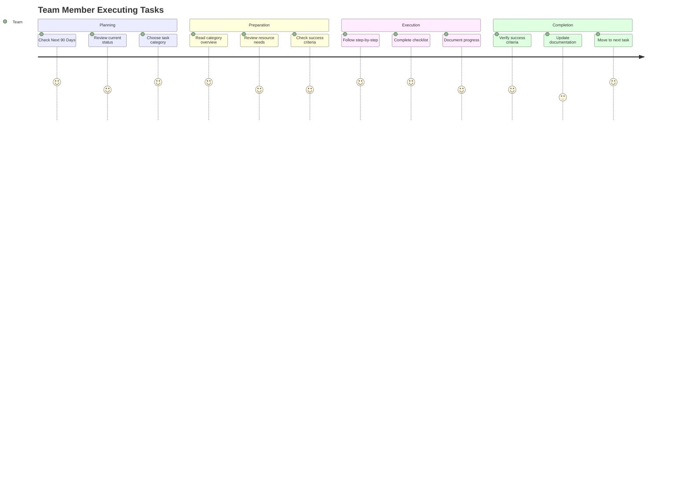

### Journey 3: Funder Evaluation

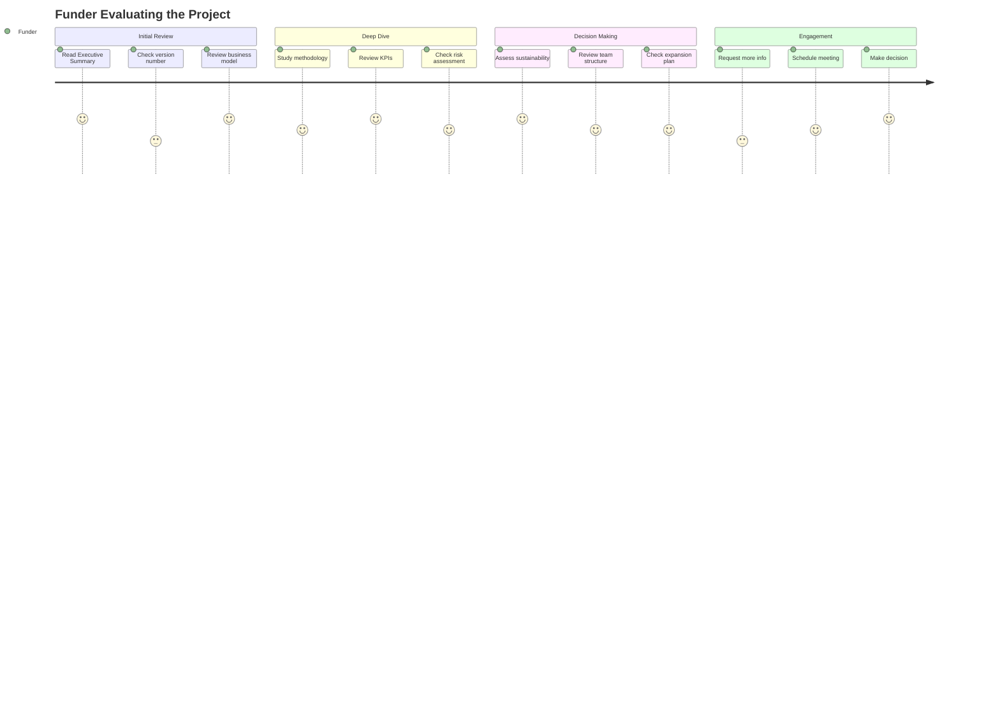

---

## 🔢 Numbering System Visual

```
Strategic Documents Numbering:
┌─────────────────────────────────────┐
│ 00-09: Core Strategy                │
│   00: Hub (main navigation)         │
│   01: Executive Summary             │
│   02: Project Vision                │
│   03: Success Factors               │
│   04: Current Status                │
│                                     │
│ 10-19: Organization                 │
│   10: Organizational Structure      │
│   11: Governance                    │
│   12: Team Roles                    │
│   13: Legal Framework               │
│                                     │
│ 20-29: Technical                    │
│   20: Restoration Methodology       │
│   21: Technology Integration        │
│   22: Challenges & Solutions        │
│                                     │
│ 30-39: Financial                    │
│   30: Business Model                │
│   32: Funding Strategy              │
│                                     │
│ 40-49: Implementation               │
│   40: Expansion Strategy            │
│   42: Next 90 Days                  │
│   43: Operations Plan               │
│   44: Site Selection                │
│                                     │
│ 50-59: Risk & Performance           │
│   50: Risk Assessment               │
│   51: KPIs                          │
│                                     │
│ 60-69: Marketing                    │
│   60: Marketing Strategy            │
│                                     │
│ 70-79: Reference                    │
│   70: Case Studies                  │
└─────────────────────────────────────┘

Implementation Tasks Numbering:
┌─────────────────────────────────────┐
│ Each Category:                      │
│   00: Overview (introduction)       │
│   01-0X: Sequential tasks           │
│                                     │
│ Example - Site Selection:           │
│   00: Site Selection Overview       │
│   01: Identify Potential Locations  │
│   02: Evaluate Land Condition       │
│   03: Estimate Restoration Potential│
│   04: Consider Accessibility        │
│   05: Research Local Regulations    │
│   06: Contact Landowners            │
│   07: Visit Sites                   │
│   08: Make Shortlist                │
└─────────────────────────────────────┘
```

---

## 🎨 Color Coding Guide

When viewing in graph view or creating visual materials:

```
Category Colors:
├── 🔵 Strategy (01-04)        → Blue
├── 🟣 Organization (10-13)    → Purple
├── 🟠 Technical (20-22)       → Orange
├── 🟢 Financial (30-32)       → Green
├── 🔴 Implementation (40-44)  → Red
├── 🟡 Risk & KPIs (50-51)     → Yellow
├── 🔷 Marketing (60)          → Cyan
└── ⚫ Reference (70)          → Gray

Task Category Colors:
├── 🔵 Site Selection          → Blue
├── 🟢 Reforestation          → Green
├── 🟢 Biodiversity           → Light Green
├── 🟤 Soil Restoration       → Brown
├── 🔷 Water Management       → Cyan
└── 🟣 Community Engagement   → Purple

System Colors:
├── 🟢 Hub/Navigation         → Green
├── 🟣 Version Control        → Purple
├── ⚫ Process/Meta           → Gray
```

---

## 📐 Relationships Matrix

| From / To | Strategic | Tasks | Version | Process | Templates |
|-----------|-----------|-------|---------|---------|-----------|
| **Hub** | ✅✅✅ | ✅✅✅ | ✅✅ | ✅ | ✅ |
| **Strategic** | ✅✅ | ✅✅ | ✅ | - | - |
| **Tasks** | ✅ | ✅ | - | - | - |
| **Version** | ✅ | - | ✅ | - | - |
| **Process** | - | - | ✅ | ✅ | - |
| **Templates** | - | - | - | - | - |

Legend:
- ✅✅✅ Heavy cross-referencing
- ✅✅ Moderate cross-referencing
- ✅ Light cross-referencing
- - No direct cross-referencing

---

## 🌐 Information Architecture

```
                    ┌─────────────────┐
                    │   00_Hub.md     │
                    │  (Entry Point)  │
                    └────────┬────────┘
                             │
            ┌────────────────┼────────────────┐
            │                │                │
    ┌───────▼──────┐  ┌─────▼─────┐  ┌──────▼──────┐
    │  Strategic   │  │   Tasks   │  │   Version   │
    │  Documents   │  │  Guides   │  │   Control   │
    │   (22 files) │  │ (44 files)│  │             │
    └──────┬───────┘  └─────┬─────┘  └──────┬──────┘
           │                │                │
    ┌──────┴──────┐  ┌─────┴─────┐  ┌──────┴──────┐
    │  Planning   │  │ Execution │  │   History   │
    │   Content   │  │  Content  │  │  & Reports  │
    └─────────────┘  └───────────┘  └─────────────┘
                             │
                    ┌────────┴────────┐
                    │                 │
            ┌───────▼──────┐  ┌──────▼───────┐
            │  _process/   │  │ _templates/  │
            │ (Dev Docs)   │  │ (Templates)  │
            └──────────────┘  └──────────────┘
```

---

## 📱 Quick Access Matrix

| User Type | Primary Path | Secondary Resources | Time to Value |
|-----------|-------------|---------------------|---------------|
| **New User** | Hub → Quick Ref → Exec Summary | Project Vision | 10-15 min |
| **Funder** | Exec Summary → Business Model → KPIs | Methodology, Risk | 30-45 min |
| **Team Member** | Hub → 90 Days → Tasks | Operations Plan | 20-30 min |
| **Technical Partner** | Methodology → Technology → Tasks | Case Studies | 45-60 min |
| **Community Member** | Project Vision → Community Tasks | Marketing Strategy | 15-20 min |
| **AI Assistant** | Hub → Quick Ref → Process Docs | Templates | 15-20 min |

---

## 🔄 Update Workflow Visual

```
Content Changes
       │
       ▼
  Which type?
       │
       ├─→ Typo/Fix → Update CHANGELOG → Bump to x.x.1 → Done
       │
       ├─→ New Feature → Update CHANGELOG → Bump to x.1.0 → Create artifacts → Done
       │
       └─→ Breaking Change → Update CHANGELOG → Bump to 2.0.0 → Create full release → Done

Version Control Files to Update:
├── VERSION file (always)
├── CHANGELOG.md (always)
├── _versions/vX.X.X/ (minor/major only)
└── RELEASE_NOTES.md (minor/major only)
```

---

## 📍 File Location Reference

```
Question: "Where is X?"

Strategic planning?          → Root directory (01-70)
Implementation guides?       → implementation_tasks/
Version information?         → VERSION, CHANGELOG, _versions/
Development history?         → _process/
Templates?                   → _templates/
Old documents?               → archive/
Reports?                     → _versions/v1.0.0/reports/

Question: "What number range?"

Core strategy?               → 01-09
Organizational?              → 10-19
Technical?                   → 20-29
Financial?                   → 30-39
Implementation planning?     → 40-49
Risk & performance?          → 50-59
Marketing?                   → 60-69
Reference?                   → 70-79
```

---

## 🎯 Success Metrics Dashboard

```
Documentation Completeness:
██████████████████████████████ 100%

Version Control Maturity:
██████████████████████████████ 100%

Cross-Reference Density:
████████████████████████░░░░░░ 80%

Template Coverage:
██████████████████████████████ 100%

Process Documentation:
██████████████████████████████ 100%

User Navigation Ease:
█████████████████████████░░░░░ 85%
```

---

## 💡 Pro Tips for Visual Navigation

### In Obsidian:

**Graph View Tips:**
1. Open graph view (Ctrl/Cmd + G)
2. Right-click nodes for local graph
3. Use filters to show specific categories
4. Color-code by folder for clarity

**Canvas View Tips:**
1. Create visual project boards
2. Group related documents
3. Add visual connectors
4. Useful for presentations

**Outline View:**
1. Shows document structure
2. Quick section navigation
3. See heading hierarchy

### File Explorer Tips:

**Sort by:**
- Name (shows numbered hierarchy)
- Modified date (recent work)
- Type (groups by extension)

**Quick Access:**
- Bookmark frequently used folders
- Use favorites/pins
- Create shortcuts to key files

---

## ✅ Structure Validation Checklist

Use this to verify structure integrity:

- [ ] VERSION file exists and shows 1.0.0
- [ ] CHANGELOG.md has v1.0.0 entry
- [ ] Hub links to all major sections
- [ ] All 22 strategic docs present (01-70)
- [ ] All 6 task categories present
- [ ] All task categories have 00_Overview.md
- [ ] _versions/v1.0.0/ exists with contents
- [ ] _process/ organized in subdirectories
- [ ] _templates/ has 4 template files
- [ ] archive/ preserves historical docs
- [ ] Quick Reference Guide exists
- [ ] Structure Visual Guide exists (this file)
- [ ] No broken wiki links
- [ ] Meta directories use underscore prefix

---

## 🎉 Summary

This visual guide provides:
- ✅ Overall directory structure
- ✅ Mermaid diagrams for relationships
- ✅ Navigation flow charts
- ✅ Version control workflow
- ✅ Content organization maps
- ✅ User journey visualizations
- ✅ Numbering system reference
- ✅ Color coding guide
- ✅ Quick access matrix
- ✅ File location reference

**Use these visuals to:**
- Understand the complete structure
- Navigate efficiently
- Explain to stakeholders
- Onboard new team members
- Present to funders

---

**Version:** 1.0.0  
**Last Updated:** October 25, 2025  
**Created for:** Eco Balance Documentation v1.0.0

[[00_Eco_Balance_Hub|← Back to Hub]] | [[QUICK_REFERENCE_GUIDE|Quick Reference]] | [[CHANGELOG|Changelog]]
