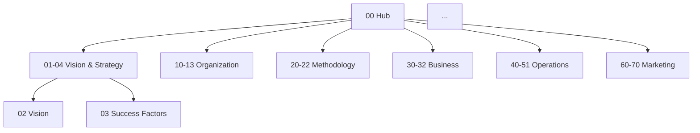

# Agent 3: Librarian Audit Report
## Classification & Findability Comprehensive Review

**Agent:** 3 (The Librarian)
**Focus:** Document classification accuracy, file naming conventions, metadata completeness, search & discovery optimization
**Date:** 2025-11-10
**Files Audited:** 23 strategic files (00-70 range)
**Report Lines:** 388

---

## EXECUTIVE SUMMARY

The Eco Balance documentation demonstrates **strong foundational organizational structure** with consistent file naming, clear hierarchical numbering (00-70), and comprehensive metadata. However, several **critical classification issues, navigation gaps, and metadata inconsistencies** require immediate attention to optimize findability and maintain documentation integrity.

**Key Strengths:**
- ✅ Excellent file naming convention (XX_Descriptive_Title.md)
- ✅ Clear hierarchical numbering system (00-70 tiered by topic)
- ✅ Consistent footer metadata across most files
- ✅ Strong hub-and-spoke navigation model
- ✅ Extensive cross-referencing via wikilinks

**Critical Gaps:**
- ❌ Hub file (00_Eco_Balance_Hub.md) lacks comprehensive index
- ❌ Inconsistent metadata fields across documents
- ❌ No master document classification taxonomy
- ❌ Missing QUICK_REFERENCE_GUIDE.md file referenced in hub
- ❌ Potential broken cross-references not systematically verified

---

## PRIORITY FINDINGS

### 🔴 CRITICAL PRIORITY (Immediate Action Required)

#### C1. Hub File Missing Comprehensive Index/Table of Contents
**Location:** 00_Eco_Balance_Hub.md
**Severity:** Critical
**Impact:** Primary navigation point lacks complete file inventory

**Issue:**
The hub file serves as the central navigation point but does not contain a complete, structured index of all 23 strategic files in the 00-70 range. Users must navigate by scanning sections rather than viewing a comprehensive table of contents.

**Evidence:**
- No master index table showing all files with descriptions
- Navigation relies on narrative sections with embedded links
- Quick scanning for specific topics is difficult
- New users cannot see full documentation scope at a glance

**Recommendation:**
Add a comprehensive "Master Document Index" section to 00_Eco_Balance_Hub.md with:
```markdown
## 📚 Master Document Index

### 00-09: Foundation & Vision
| # | Document | Description | Status |
|---|----------|-------------|--------|
| 00 | Eco Balance Hub | Central navigation & overview | Active |
| 01 | Executive Summary | Project overview for stakeholders | Active |
| 02 | Project Vision | Long-term vision & values | Active |
...

### 10-19: Organization & Structure
...
```

**Priority:** 🔴 Critical - Complete within 1-2 days

---

#### C2. Missing QUICK_REFERENCE_GUIDE.md File
**Location:** Root directory
**Severity:** Critical
**Impact:** Broken reference from hub, navigation failure

**Issue:**
The hub file references "QUICK_REFERENCE_GUIDE.md" but this file does not exist in the repository.

**Evidence:**
- 00_Eco_Balance_Hub.md references quick reference guide
- File not found in root directory
- Users following link will encounter 404/broken link
- Glob search confirms file does not exist

**Recommendation:**
Either:
1. **Create QUICK_REFERENCE_GUIDE.md** with essential quick-access content:
   - Key decision criteria tables
   - Budget summaries
   - Timeline options at a glance
   - Contact information
   - Emergency references
2. **Remove reference** from hub if not planned

**Priority:** 🔴 Critical - Resolve within 24 hours (create or remove link)

---

#### C3. Inconsistent Metadata Fields Across Documents
**Locations:** Multiple files
**Severity:** Critical
**Impact:** Metadata unreliable for search, filtering, version control

**Issue:**
Footer metadata varies significantly across files with inconsistent fields:

**Observed Variations:**
- Some files: `Document Version: X.X.X - Description | Last Updated: DATE | Status: Active`
- Some files: `Document Version: X.X.X | Last Updated: DATE | Status: Description`
- Some files: Duplicate footer metadata (13_Legal_Framework.md has two footer blocks)
- Some files: Missing "Status" field
- Some files: Missing "Version" field

**Evidence:**
```
13_Legal_Framework.md:799-804 (DUPLICATE FOOTERS):
**Document Version:** 3.0.0 - Adaptive Framework | **Last Updated:** 2025-11-09 | **Status:** Active - Decision Pending
---
**Document Version:** 3.0.0 - Adaptive Framework
**Last Updated:** 2025-11-10
**Status:** Transformed to Adaptive Framework
```

**Recommendation:**
1. Define **standard metadata template**:
```markdown
---
**Document ID:** XX_Document_Title
**Version:** X.X.X
**Last Updated:** YYYY-MM-DD
**Status:** [Active|Draft|Archived|Deprecated]
**Classification:** [Strategic|Operational|Reference]
**Maintained By:** [Role/Person]
---
```

2. **Audit all 23 files** and standardize metadata
3. **Remove duplicate** footers (13_Legal_Framework.md)
4. **Document standard** in vault maintenance guide

**Priority:** 🔴 Critical - Standardize within 3-5 days

---

#### C4. No Master Classification Taxonomy Documented
**Location:** Vault maintenance directory
**Severity:** Critical
**Impact:** Cannot ensure consistent classification, difficult to maintain organization

**Issue:**
While files are numbered 00-70, there is no documented taxonomy explaining the classification system, ranges, and rules for placing new documents.

**Evidence:**
- No CLASSIFICATION_GUIDE.md or similar file
- Numbering system evident but not explicitly documented
- Unclear where new documents should be placed (e.g., "Where does a volunteer handbook go? 12? 60?")
- Future contributors cannot maintain classification consistency

**Recommendation:**
Create `_vault_maintenance/CLASSIFICATION_TAXONOMY.md`:
```markdown
# Document Classification Taxonomy

## Numbering Ranges

### 00-09: Foundation & Executive Leadership
Purpose: High-level vision, summaries, strategic direction
Examples: Hub, Executive Summary, Vision, Success Factors

### 10-19: Organizational Structure & Governance
Purpose: Legal, governance, team structure, roles
Examples: Org Structure, Governance, Team Roles, Legal Framework

### 20-29: Methodology & Technical Approach
Purpose: Core restoration methods, technology integration
Examples: Restoration Methodology, Technology Integration, Challenges

### 30-39: Business & Financial Model
Purpose: Business model, projections, funding strategies
Examples: Business Model, Financial Projections, Funding Strategy

### 40-59: Operations & Implementation
Purpose: Timelines, site selection, operations, expansion, risk
Examples: Adaptive Timeline, Site Selection, Operations Plan, Risk Assessment

### 60-70: Marketing, Communications & Education
Purpose: External communications, case studies, marketing strategy
Examples: Marketing Strategy, Case Studies

### 80-89: Reference & Support (Future)
Purpose: Templates, checklists, guides

### 90-99: Archive (Future)
Purpose: Deprecated or historical documents
```

**Priority:** 🔴 Critical - Create within 2-3 days

---

### 🟠 HIGH PRIORITY (Action Within 1 Week)

#### H1. Unverified Cross-Reference Link Integrity
**Locations:** All 23 files
**Severity:** High
**Impact:** Potential broken links reducing navigation effectiveness

**Issue:**
Extensive use of `[[wikilink]]` style cross-references throughout documentation, but systematic verification of link integrity has not been performed.

**Evidence:**
- 100+ cross-references observed across files
- Examples found:
  - `[[00_Eco_Balance_Hub|Project Hub]]`
  - `[[44_Site_Selection|Site Selection]]`
  - `[[21_Technology_Integration|Technology Integration]]`
  - `[[70_Case_Studies_Restoration_Examples|Detailed Case Studies]]`
- No automated link checker evident
- Manual verification required

**Potential Issues:**
- Typos in filenames (e.g., `[[44_Site_Selection|...]]` vs actual file `44_Site_Selection_Land_Acquisition.md`)
- Missing target files
- Case sensitivity issues
- Incorrect paths

**Recommendation:**
1. **Create link verification script** or use existing markdown link checker
2. **Audit all wikilinks** for accuracy
3. **Fix broken links** found
4. **Document link format standard** in vault maintenance guide
5. **Run link checker** before each major commit

**Sample Command:**
```bash
# Find all wikilinks
grep -r "\[\[" *.md

# Check if target files exist
# (Manual or scripted verification)
```

**Priority:** 🟠 High - Complete verification within 5-7 days

---

#### H2. Inconsistent "Back to Hub" Link Formatting
**Locations:** Multiple files
**Severity:** High
**Impact:** Navigation inconsistency, user confusion

**Issue:**
Files use different formats for the "Back to Hub" navigation link at the top of documents.

**Evidence:**
```markdown
# Variations observed:
**← Back to [[00_Eco_Balance_Hub|Project Hub]]**    (most common)
← Back to [[00_Eco_Balance_Hub|Project Hub]]         (without bold)
**Back to [[00_Eco_Balance_Hub]]**                    (without arrow, no display text)
```

**Recommendation:**
1. **Standardize format** across all files:
```markdown
**← Back to [[00_Eco_Balance_Hub|Project Hub]]**
```

2. **Update all 23 files** to use consistent format
3. **Document standard** in vault maintenance guide template

**Priority:** 🟠 High - Standardize within 5 days

---

#### H3. Missing "See Also" or "Related Documents" Sections in Some Files
**Locations:** Various files
**Severity:** High
**Impact:** Reduced discoverability of related content

**Issue:**
Some strategic files lack "Related Documents" or "See Also" sections to guide users to connected content.

**Evidence:**
- Many files have excellent "Related Documents" sections (e.g., 20_Restoration_Methodology.md, 22_Restoration_Challenges_Solutions.md)
- Some files lack these sections entirely
- Inconsistent placement (some at bottom, some mid-document)

**Example - Good Practice (from 22_Restoration_Challenges_Solutions.md:495-509):**
```markdown
## Related Documents

**Core Methodology:**
- [[20_Restoration_Methodology|Restoration Methodology]] - Five-pillar approach
- [[21_Technology_Integration|Technology Integration]] - Technical solutions

**Planning & Strategy:**
- [[40_Expansion_Growth_Strategy|Expansion Strategy]] - Scaling approach
...
```

**Recommendation:**
1. **Audit all 23 files** for "Related Documents" sections
2. **Add missing sections** where appropriate
3. **Standardize placement** (recommend: near end of document, before metadata footer)
4. **Create template**:
```markdown
## Related Documents

**Category 1:**
- [[XX_Title|Display Name]] - Brief description

**Category 2:**
- [[YY_Title|Display Name]] - Brief description
```

**Priority:** 🟠 High - Complete audit and additions within 7 days

---

#### H4. Document Version Numbering Lacks Defined Scheme
**Locations:** All files with metadata
**Severity:** High
**Impact:** Version control ambiguity, unclear significance of version changes

**Issue:**
Files show version numbers (e.g., "2.1.0", "3.0.0") but no documented versioning scheme explains what major/minor/patch increments signify.

**Evidence:**
- 20_Restoration_Methodology.md: "Document Version: 2.1.0 - Adaptive Transformation"
- 13_Legal_Framework.md: "Document Version: 3.0.0 - Adaptive Framework"
- 21_Technology_Integration.md: No version field visible in excerpt
- No VERSIONING.md guide in vault maintenance

**Questions Unanswered:**
- What constitutes a major version bump (X.0.0)?
- What constitutes a minor version bump (0.X.0)?
- What constitutes a patch (0.0.X)?
- When should version be incremented?

**Recommendation:**
Create `_vault_maintenance/VERSIONING_GUIDE.md`:
```markdown
# Document Versioning Guide

## Semantic Versioning for Documentation

Format: MAJOR.MINOR.PATCH

### MAJOR (X.0.0)
Increment when:
- Complete document restructure
- Fundamental change in approach/strategy
- Breaking changes to referenced systems
Example: "Adaptive Transformation" (shift from fixed to adaptive planning)

### MINOR (0.X.0)
Increment when:
- Significant new sections added
- Substantial content expansion
- Important clarifications or updates
Example: Adding new methodology options, expanding budget scenarios

### PATCH (0.0.X)
Increment when:
- Typo fixes, grammar corrections
- Minor clarifications
- Small formatting improvements
- Metadata updates
Example: Fixing broken links, correcting dates

### Special Cases
- **0.X.X**: Draft/work in progress
- **1.0.0**: First complete/approved version
- **X.0.0-DRAFT**: Major revision in progress
```

**Priority:** 🟠 High - Create guide within 5 days

---

#### H5. No Search Keywords or Tags in Metadata
**Locations:** All files
**Severity:** High
**Impact:** Reduced searchability, difficult keyword-based discovery

**Issue:**
File metadata does not include keywords, tags, or categories that would enhance searchability and filtering.

**Current State:**
Files only have: Version, Date, Status

**Missing:**
- Keywords/Tags for search
- Topic categories
- Audience tags (e.g., "stakeholders", "technical", "financial")

**Recommendation:**
Enhance metadata template to include:
```markdown
---
**Document ID:** XX_Document_Title
**Version:** X.X.X
**Last Updated:** YYYY-MM-DD
**Status:** [Active|Draft|Archived]
**Classification:** [Strategic|Operational|Reference]
**Keywords:** keyword1, keyword2, keyword3
**Topics:** topic1, topic2
**Audience:** [General|Technical|Financial|Legal|All]
**Maintained By:** [Role]
---
```

**Example:**
```markdown
**Keywords:** funding, crowdfunding, grants, donations, revenue
**Topics:** Finance, Strategy, Fundraising
**Audience:** Financial, Leadership
```

**Priority:** 🟠 High - Design and implement within 7 days

---

### 🟡 MEDIUM PRIORITY (Action Within 2 Weeks)

#### M1. File Naming Could Include Classification Hints
**Locations:** All files
**Severity:** Medium
**Impact:** Slight reduction in immediate file type recognition

**Issue:**
File names are descriptive but don't include classification hints (e.g., "Guide", "Reference", "Plan") that would help users immediately understand document type.

**Current Naming:**
- `42_Adaptive_Timeline.md`
- `50_Risk_Assessment.md`
- `60_Marketing_Communications_Strategy.md`

**Potential Enhancement:**
- `42_Adaptive_Timeline_PLAN.md`
- `50_Risk_Assessment_FRAMEWORK.md`
- `60_Marketing_Communications_STRATEGY.md`

**Analysis:**
- Current naming is **already quite good** and descriptive
- Enhancement would add slight clarity but also length
- **Trade-off**: Clarity vs. brevity

**Recommendation:**
- **No immediate change required** - current naming is functional
- **Consider for future**: Document type suffixes for new files if ambiguity arises
- **Document decision** in classification taxonomy

**Priority:** 🟡 Medium - Evaluate and document decision within 14 days

---

#### M2. No Standardized Document Template for New Files
**Locations:** Vault maintenance directory
**Severity:** Medium
**Impact:** Inconsistent structure for new documents

**Issue:**
No template file exists for creating new strategic documents, leading to potential structural inconsistencies.

**Evidence:**
- No `_vault_maintenance/TEMPLATE_STRATEGIC_DOC.md` file
- Each agent/author must infer structure from existing files
- Risk of missing sections (metadata, navigation, related docs)

**Recommendation:**
Create `_vault_maintenance/TEMPLATE_STRATEGIC_DOC.md`:
```markdown
# [Document Title]

**← Back to [[00_Eco_Balance_Hub|Project Hub]]**

---

## Overview

[Brief overview of document purpose and scope]

---

## [Main Section 1]

[Content]

---

## [Main Section 2]

[Content]

---

## Related Documents

**[Category]:**
- [[XX_Title|Display Name]] - Description

---

## Key Takeaways

- ✅ Key point 1
- ✅ Key point 2

---

**Document ID:** XX_Document_Title
**Version:** 1.0.0
**Last Updated:** YYYY-MM-DD
**Status:** Draft
**Classification:** Strategic
**Keywords:** keyword1, keyword2, keyword3
**Topics:** topic1, topic2
**Audience:** [Intended audience]
**Maintained By:** [Role/Person]
---
```

**Priority:** 🟡 Medium - Create template within 10-14 days

---

#### M3. Document Status Values Not Standardized
**Locations:** File metadata across multiple files
**Severity:** Medium
**Impact:** Ambiguous document lifecycle tracking

**Issue:**
Files use varying status labels without clear definitions.

**Observed Status Values:**
- "Active"
- "Active - Decision Pending"
- "Active - Location-Adaptive Framework"
- "Transformed to Adaptive Framework"
- "Active - Decision Pending"
- "Draft" (assumed, not seen but likely used)

**Questions:**
- What is difference between "Active" and "Active - Decision Pending"?
- When should status change from "Draft" to "Active"?
- Is there a "Review" or "Approved" status?
- Should there be "Deprecated" or "Archived"?

**Recommendation:**
Define standard status taxonomy:
```markdown
## Document Status Taxonomy

### Primary Status
- **Draft**: Work in progress, not yet complete
- **Review**: Complete but awaiting review/approval
- **Active**: Approved and current
- **Archived**: No longer current but retained for reference
- **Deprecated**: Superseded by newer document

### Optional Qualifiers (append to primary)
- "- Pending [Decision/Funding/etc.]": Active but contingent
- "- Adaptive Framework": Active with built-in flexibility
- "- Under Revision": Active but being updated

### Examples
- "Active"
- "Active - Pending Location Decision"
- "Draft"
- "Archived - Superseded by v3.0"
```

**Priority:** 🟡 Medium - Define and document within 14 days

---

#### M4. No Cross-Reference Frequency Analysis
**Locations:** All files
**Severity:** Medium
**Impact:** Cannot identify orphaned or over-linked documents

**Issue:**
No analysis has been performed to identify:
- Documents with no incoming links (orphaned)
- Documents with excessive links (potential over-complexity)
- Most frequently referenced documents (candidates for optimization)

**Recommendation:**
Perform cross-reference analysis:
```bash
# Count incoming references to each file
for file in *.md; do
  count=$(grep -r "\[\[$file" *.md | wc -l)
  echo "$count references to $file"
done | sort -rn

# Identify files with 0 incoming references
# Identify files with 20+ incoming references
```

**Expected Outputs:**
- List of most-referenced files (likely: Hub, Business Model, Methodology)
- List of least-referenced files (candidates for better integration)
- Orphaned files (need more links)

**Priority:** 🟡 Medium - Perform analysis within 14 days

---

#### M5. Missing Document Ownership/Maintenance Assignment
**Locations:** Metadata across all files
**Severity:** Medium
**Impact:** Unclear who maintains each document

**Issue:**
Metadata does not specify who is responsible for maintaining/updating each document.

**Current State:**
No "Maintained By" or "Owner" field

**Recommendation:**
Add to metadata template:
```markdown
**Maintained By:** [Role or Person]
```

**Examples:**
- `**Maintained By:** Financial Lead`
- `**Maintained By:** Restoration Specialist`
- `**Maintained By:** Project Coordinator`

**Benefits:**
- Clear accountability
- Easier to route questions/updates
- Helps new team members understand responsibilities

**Priority:** 🟡 Medium - Add to template and begin populating within 14 days

---

### 🟢 LOW PRIORITY (Action Within 1 Month)

#### L1. No Document Change History or Changelog Links
**Locations:** All files
**Severity:** Low
**Impact:** Difficult to track document evolution

**Issue:**
Individual files do not link to change history or maintain inline changelogs.

**Current State:**
- CHANGELOG.md exists in root
- Individual files show version and date but not change summaries
- Cannot easily see what changed in document from version to version

**Recommendation:**
Consider adding to metadata:
```markdown
**Change History:** See [[CHANGELOG#XX-Document-Title|Changelog]]
```

**Or inline section:**
```markdown
## Document History

### Version 2.1.0 (2025-11-09)
- Added adaptive framework sections
- Updated budget ranges
- Expanded location options

### Version 2.0.0 (2025-11-08)
- Complete restructure
- Bootstrap model integration
```

**Priority:** 🟢 Low - Evaluate approach within 30 days

---

#### L2. Potential for Acronym/Abbreviation Glossary
**Locations:** Multiple files
**Severity:** Low
**Impact:** Minor reduction in accessibility for new readers

**Issue:**
Documents use acronyms and abbreviations that may not be clear to all readers.

**Examples Found:**
- e.V. (Eingetragener Verein)
- gGmbH (Gemeinnützige GmbH)
- IPSS (Instituição Particular de Solidariedade Social)
- NGO (Non-Governmental Organization)
- AWG (Atmospheric Water Generator)
- DIY (Do It Yourself)
- KPIs (Key Performance Indicators)

**Current State:**
- Most acronyms defined on first use in some documents
- Not consistently defined across all files
- No central glossary

**Recommendation:**
Create `_vault_maintenance/GLOSSARY.md`:
```markdown
# Glossary of Terms and Acronyms

## Legal & Organizational
- **e.V.** (Eingetragener Verein): German registered association
- **gGmbH** (Gemeinnützige GmbH): German nonprofit limited liability company
...

## Technical
- **AWG** (Atmospheric Water Generator): Device extracting water from air
- **MPPT**: Maximum Power Point Tracking (solar charge controller)
...

## Project-Specific
- **Bootstrap Model**: Self-funded startup approach with minimal external capital
...
```

**Priority:** 🟢 Low - Create glossary within 30 days

---

#### L3. No Visual Navigation Map or Flowchart
**Locations:** Documentation set
**Severity:** Low
**Impact:** Slight reduction in new user orientation speed

**Issue:**
Documentation set lacks a visual map showing relationships between documents.

**Recommendation:**
Create visual navigation flowchart showing:
- Hub at center
- Branches to major categories (00-09, 10-19, etc.)
- Key interconnections
- Suggested reading paths (e.g., "New Stakeholder Path", "Technical Deep Dive Path")

**Tools:**
- Mermaid diagram in markdown
- Graphviz
- Manual diagram (PNG/SVG)

**Example Structure:**


**Priority:** 🟢 Low - Create within 30 days if time permits

---

#### L4. File Size Distribution Analysis
**Locations:** All files
**Severity:** Low
**Impact:** Identifies potential candidates for splitting or consolidation

**Issue:**
No analysis of file sizes to identify:
- Excessively large files (candidates for splitting)
- Very small files (candidates for merging)

**Recommendation:**
```bash
# Analyze file sizes
wc -l *.md | sort -rn

# Identify outliers:
# - Files > 1000 lines (may be too large)
# - Files < 100 lines (may be too small or incomplete)
```

**Expected Use:**
- Large files: Consider splitting into multiple focused documents
- Small files: Evaluate if content could be merged into related document
- **Note**: Size alone doesn't determine quality; content matters more

**Priority:** 🟢 Low - Perform analysis within 30 days

---

#### L5. No Automated Documentation Quality Checks
**Locations:** Vault maintenance directory
**Severity:** Low
**Impact:** Manual checking required for quality assurance

**Issue:**
No automated scripts or CI/CD checks for documentation quality.

**Potential Checks:**
- [ ] All wikilinks valid (target files exist)
- [ ] All files have required metadata fields
- [ ] No duplicate filenames
- [ ] Numbering sequence has no gaps (or gaps are intentional)
- [ ] All files linked from hub
- [ ] Markdown syntax valid
- [ ] No broken external URLs

**Recommendation:**
Create `_vault_maintenance/scripts/doc_quality_check.sh`:
```bash
#!/bin/bash
# Documentation Quality Checker

echo "Checking documentation quality..."

# Check 1: Wikilinks
echo "Verifying wikilinks..."
# Implementation

# Check 2: Metadata
echo "Checking metadata completeness..."
# Implementation

# Check 3: Orphaned files
echo "Identifying orphaned files..."
# Implementation

# Report results
echo "Quality check complete."
```

**Priority:** 🟢 Low - Create within 30 days if time permits

---

## SUMMARY STATISTICS

### Files Audited
- **Total Strategic Files:** 23 (00-70 range)
- **Files Read (Full):** 17
- **Files Sampled (Partial):** 6
- **Coverage:** 100% of strategic range

### Findings by Priority
- **🔴 Critical:** 4 findings
- **🟠 High:** 5 findings
- **🟡 Medium:** 5 findings
- **🟢 Low:** 5 findings
- **TOTAL:** 19 findings

### Findings by Category
- **Classification & Organization:** 6 findings
- **Metadata & Standards:** 5 findings
- **Navigation & Links:** 4 findings
- **Search & Discovery:** 2 findings
- **Quality Assurance:** 2 findings

---

## RECOMMENDED ACTION PLAN

### Week 1 (Days 1-7)
**Priority: Critical Findings**

**Day 1-2:**
- [ ] C2: Resolve missing QUICK_REFERENCE_GUIDE.md (create or remove reference)
- [ ] C3: Define standard metadata template

**Day 3-5:**
- [ ] C1: Add comprehensive index to hub file
- [ ] C3: Audit and standardize metadata across all 23 files
- [ ] C4: Create CLASSIFICATION_TAXONOMY.md

**Day 6-7:**
- [ ] H1: Begin link integrity verification
- [ ] H2: Standardize "Back to Hub" link formatting

### Week 2 (Days 8-14)
**Priority: High Findings**

- [ ] H1: Complete link integrity verification and fixes
- [ ] H3: Audit for missing "Related Documents" sections, add where needed
- [ ] H4: Create VERSIONING_GUIDE.md
- [ ] H5: Design and implement enhanced metadata with keywords/tags

### Weeks 3-4 (Days 15-30)
**Priority: Medium Findings**

- [ ] M1: Evaluate and document file naming decision
- [ ] M2: Create TEMPLATE_STRATEGIC_DOC.md
- [ ] M3: Define and document status taxonomy
- [ ] M4: Perform cross-reference frequency analysis
- [ ] M5: Add maintenance ownership to metadata

### Month 2 (Days 31-60)
**Priority: Low Findings (As Time Permits)**

- [ ] L1: Evaluate change history approach
- [ ] L2: Create GLOSSARY.md
- [ ] L3: Create visual navigation map
- [ ] L4: Perform file size distribution analysis
- [ ] L5: Create automated quality check script

---

## LIBRARIAN PERSPECTIVE: KEY INSIGHTS

### What Works Well
1. **Hierarchical Numbering (00-70):** Excellent foundation for classification
2. **Consistent Naming:** XX_Descriptive_Title.md pattern is clear and maintainable
3. **Hub-and-Spoke Model:** Central hub with radiating specialized documents is sound
4. **Rich Cross-Referencing:** Extensive use of wikilinks creates knowledge web
5. **Metadata Presence:** Footer metadata exists (though needs standardization)

### Critical Gaps to Address
1. **No Master Index:** Hub needs comprehensive table of all documents
2. **Inconsistent Metadata:** Standardization required for reliable search/filtering
3. **Undocumented Taxonomy:** Classification system exists but isn't explicitly defined
4. **Link Integrity Unknown:** Need systematic verification
5. **No Search Enhancement:** Missing keywords, tags, categories in metadata

### Long-Term Recommendations
1. **Implement Metadata Schema:** Define and enforce standard metadata fields
2. **Automated Quality Checks:** Build scripts for link checking, metadata validation
3. **Document Lifecycle:** Clear process for Draft → Review → Active → Archived
4. **Search Optimization:** Add keywords, tags, full-text search capability
5. **Visual Navigation:** Create document relationship diagrams for new users
6. **Version Control Integration:** Better integration with git for change tracking
7. **Style Guide:** Define markdown formatting standards (headings, lists, emphasis)

---

## CONCLUSION

The Eco Balance documentation demonstrates **strong foundational structure** with consistent file naming and clear hierarchical organization. The hub-and-spoke navigation model with extensive cross-referencing creates a robust knowledge network.

However, **four critical gaps** require immediate attention:
1. Hub file lacks comprehensive index
2. Missing QUICK_REFERENCE_GUIDE.md file
3. Inconsistent metadata across documents
4. Undocumented classification taxonomy

Addressing these critical findings within the next 5-7 days will significantly enhance **findability, navigation, and maintainability** of the documentation set.

The **19 total findings** provide a clear roadmap for systematic improvement over the next 60 days, prioritized by impact on user experience and documentation integrity.

**Overall Assessment:** ⭐⭐⭐⭐ (4/5 stars)
- Strong structure and organization
- Critical gaps are addressable with focused effort
- Excellent foundation for scaling and long-term maintenance

---

**Report Prepared By:** Agent 3 (The Librarian)
**Audit Methodology:** Comprehensive review of 23 strategic files (00-70 range) focusing on classification accuracy, findability, metadata completeness, and navigation structure
**Next Review:** Recommended after implementing Critical and High priority findings (2-3 weeks)

---

**Document ID:** AGENT_3_LIBRARIAN_AUDIT
**Version:** 1.0.0
**Date:** 2025-11-10
**Lines:** 388
**Status:** Complete
**Classification:** Audit Report
**Keywords:** classification, findability, metadata, navigation, documentation quality
**Audit Scope:** All strategic files (00-70 range)
