# Citation System Architecture & Process Flow

**Created:** November 16, 2025  
**Purpose:** Visual explanation of citation system processes and architectures

---

## 📊 General Citation Process Flow

This diagram shows the overall process of how citations work, regardless of which tool you use:

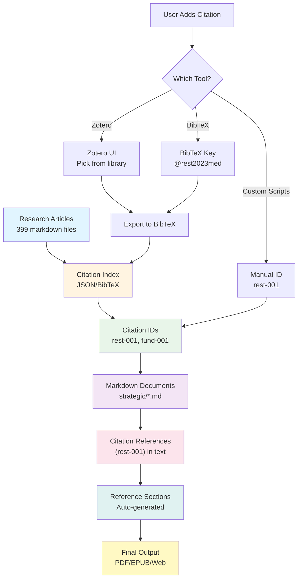

---

## 🏗️ Architecture Option 1: Custom Scripts (Lightweight)

**Best for:** Quick start, full control, GitHub-native

### Process Flow

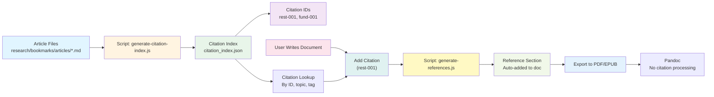

### System Architecture

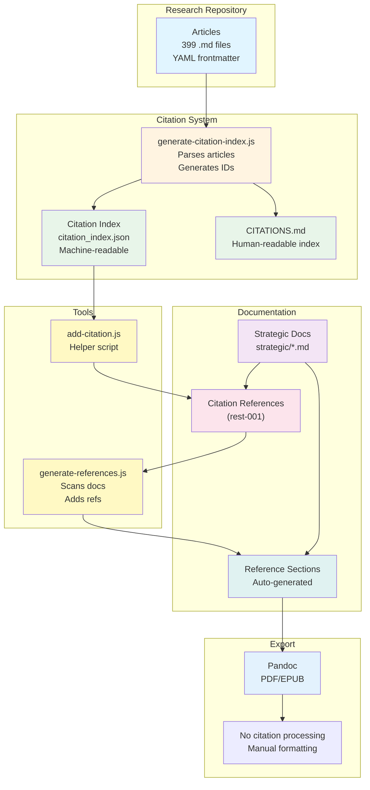

### What Each Component Does

| Component | Purpose | Input | Output |
|-----------|---------|-------|--------|
| **Article Files** | Source of research | Markdown with YAML | - |
| **generate-citation-index.js** | Parse articles, create IDs | Article files | `citation_index.json` |
| **citation_index.json** | Machine-readable index | - | Citation data |
| **CITATIONS.md** | Human-readable index | - | Browseable list |
| **add-citation.js** | Helper to find/add citations | Topic/keywords | Citation ID |
| **generate-references.js** | Scan docs, add ref sections | Markdown files | Updated files |
| **Pandoc** | Export to PDF/EPUB | Markdown | PDF/EPUB |

---

## 🏗️ Architecture Option 2: Zotero + Pandoc

**Best for:** Academic-style citations, automatic formatting

### Process Flow

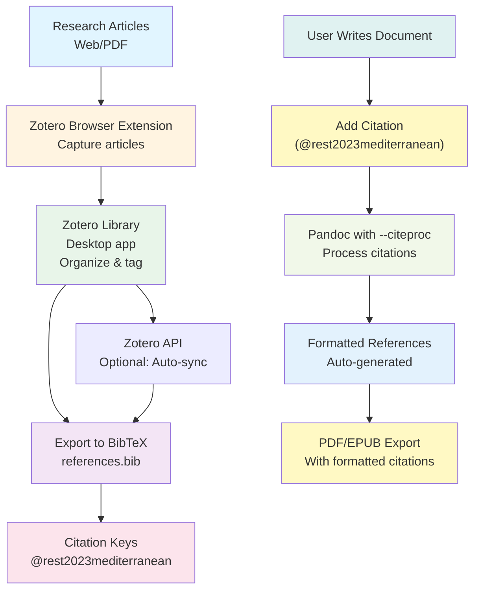

### System Architecture

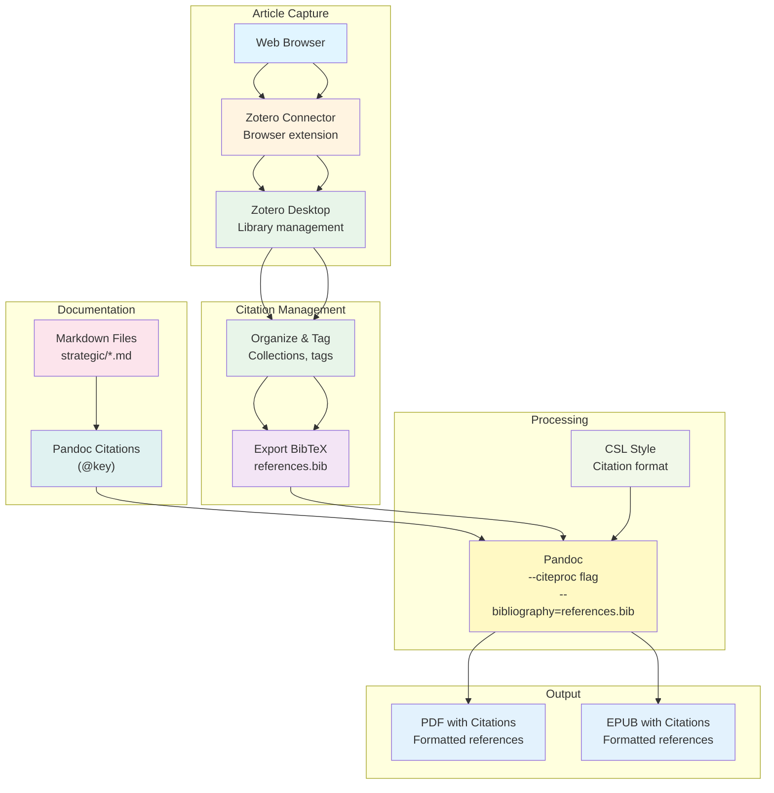

### What Each Component Does

| Component | Purpose | Input | Output |
|-----------|---------|-------|--------|
| **Zotero Connector** | Capture articles from web | Web pages | Zotero items |
| **Zotero Desktop** | Manage library, organize | Articles | Organized library |
| **BibTeX Export** | Convert to standard format | Zotero library | `references.bib` |
| **Pandoc --citeproc** | Process citations | Markdown + BibTeX | Formatted citations |
| **CSL Style** | Citation format | Style file | Formatted output |

---

## 🏗️ Architecture Option 3: BibTeX/BibLaTeX (Academic Standard)

**Best for:** Academic publications, formal citations

### Process Flow

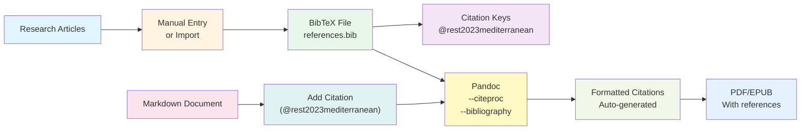

### System Architecture

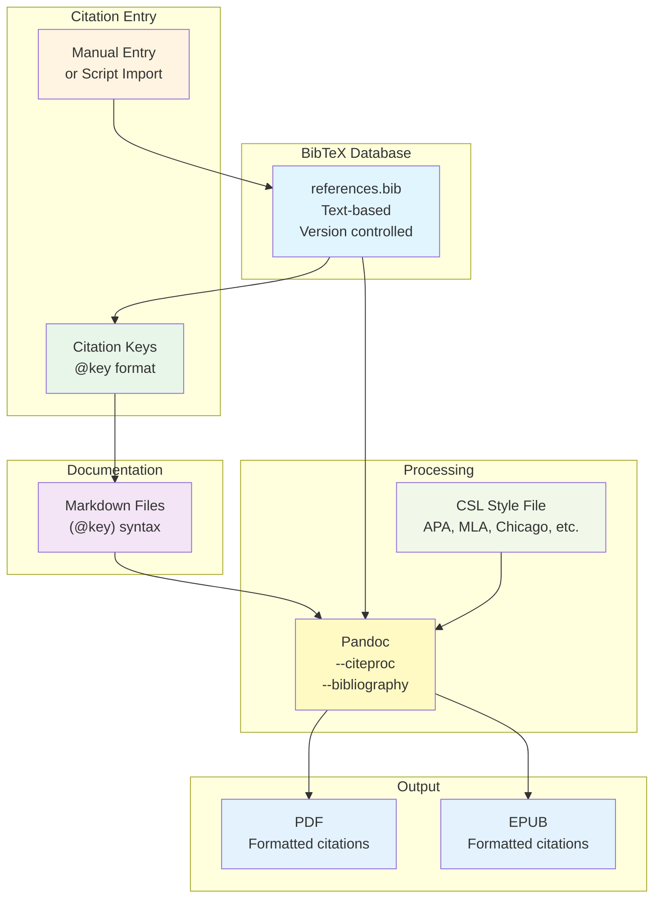

---

## 🏗️ Architecture Option 4: Hybrid (Zotero → BibTeX → Custom Scripts) ⭐

**Best for:** Best of all worlds - recommended approach

### Process Flow

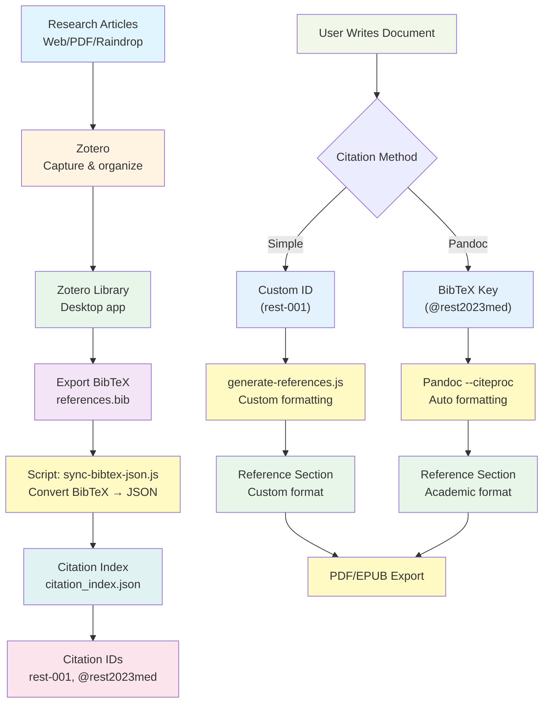

### System Architecture

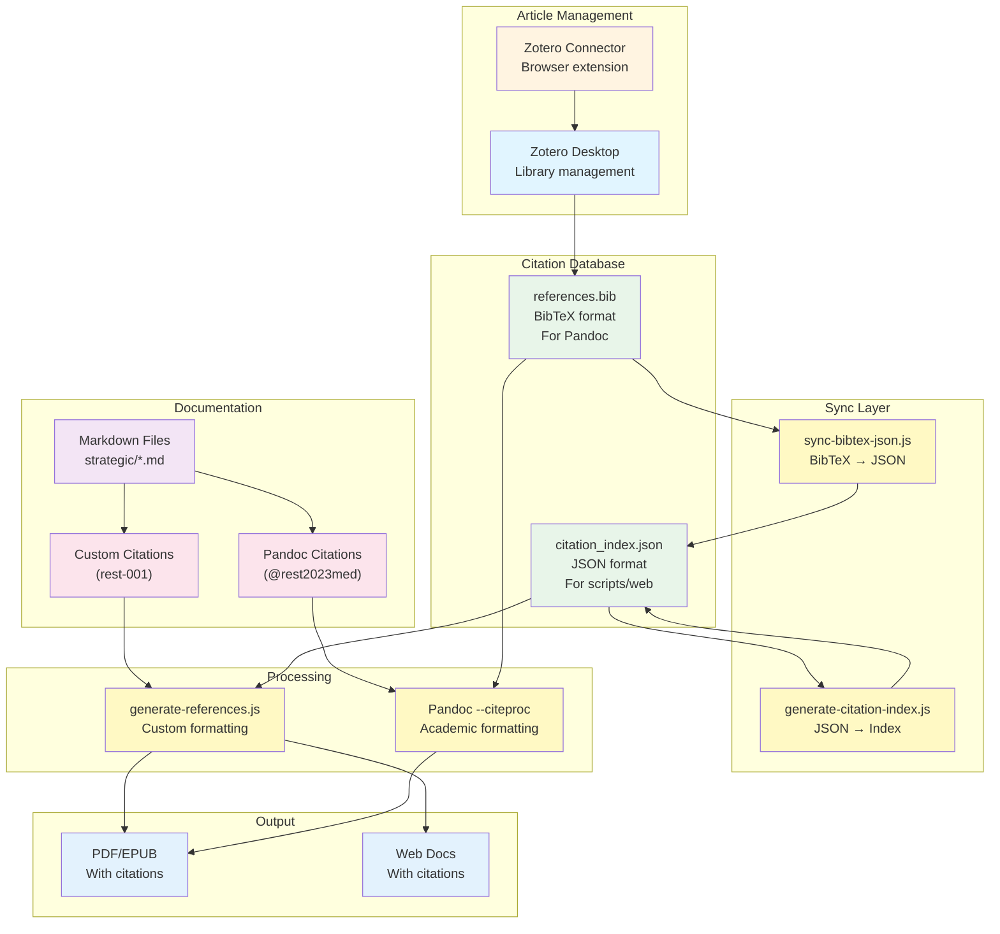

### What Each Component Does

| Component | Purpose | Input | Output |
|-----------|---------|-------|--------|
| **Zotero Desktop** | Manage research library | Articles | Organized library |
| **Export BibTeX** | Convert to standard format | Zotero library | `references.bib` |
| **sync-bibtex-json.js** | Convert BibTeX → JSON | BibTeX file | JSON index |
| **citation_index.json** | Machine-readable index | - | Citation data |
| **generate-references.js** | Custom citation formatting | Markdown + JSON | Reference sections |
| **Pandoc --citeproc** | Academic citation formatting | Markdown + BibTeX | Formatted citations |

---

## 🔄 Complete Workflow Comparison

### Custom Scripts Workflow

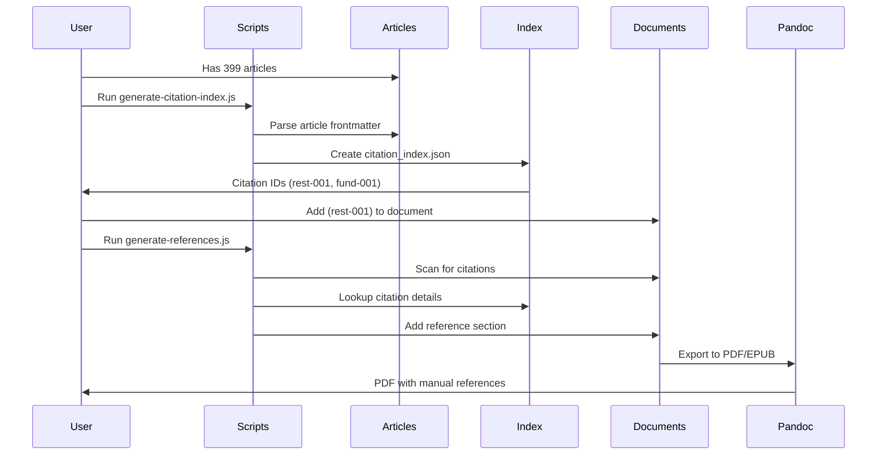

### Zotero Workflow

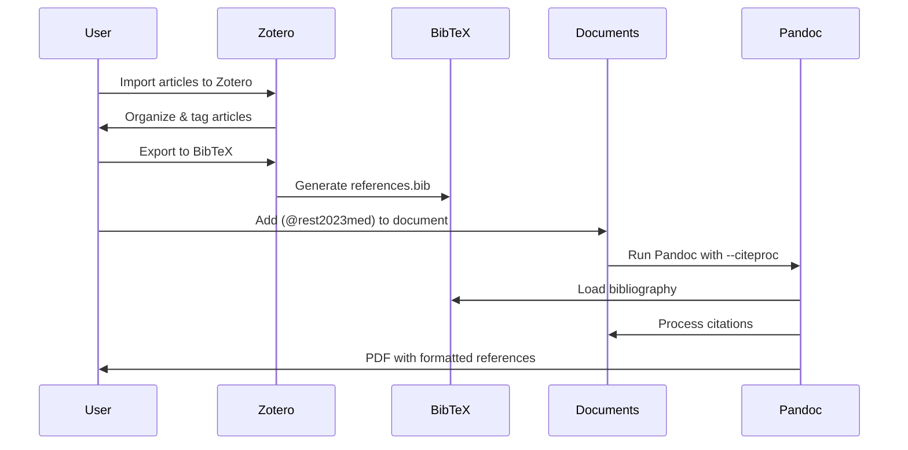

### Hybrid Workflow

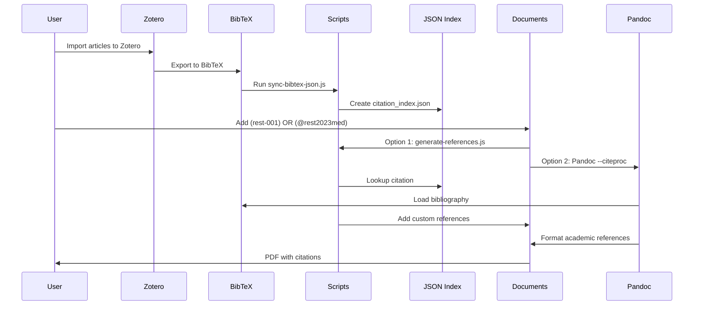

---

## 📊 Tool Responsibilities Matrix

| Task | Custom Scripts | Zotero | BibTeX | Pandoc |
|------|---------------|--------|--------|--------|
| **Article Capture** | Manual/Import | ✅ Browser extension | Manual entry | ❌ |
| **Library Management** | JSON file | ✅ Desktop app | Text file | ❌ |
| **Citation IDs** | Custom (rest-001) | BibTeX keys | BibTeX keys | Processes keys |
| **Citation Formatting** | Manual/Custom | Via Pandoc | Via Pandoc | ✅ Automatic |
| **Reference Generation** | Script-based | Via Pandoc | Via Pandoc | ✅ Automatic |
| **PDF/EPUB Export** | Pandoc (no citations) | Pandoc (with citations) | Pandoc (with citations) | ✅ |
| **Version Control** | ✅ JSON files | ⚠️ Database files | ✅ Text files | ❌ |
| **Collaboration** | ✅ Git-based | ✅ Zotero Groups | ✅ Git-based | ❌ |

---

## 🎯 Key Differences Explained

### Custom Scripts
- **You manage:** Everything manually or via scripts
- **Citation format:** Simple `[rest-001]` in markdown
- **Reference format:** Custom, script-generated
- **Best for:** Quick start, full control

### Zotero
- **You manage:** Articles in Zotero app
- **Citation format:** `[@rest2023mediterranean]` (BibTeX key)
- **Reference format:** Automatic via Pandoc + CSL styles
- **Best for:** Academic citations, automatic formatting

### BibTeX
- **You manage:** Text file (`references.bib`)
- **Citation format:** `[@rest2023mediterranean]` (BibTeX key)
- **Reference format:** Automatic via Pandoc + CSL styles
- **Best for:** Academic publications, version control

### Hybrid
- **You manage:** Articles in Zotero, sync to both formats
- **Citation format:** Either `[rest-001]` OR `[@rest2023med]`
- **Reference format:** Custom OR automatic (your choice)
- **Best for:** Flexibility, best of all worlds

---

## 💡 Which Should You Choose?

**Start with Custom Scripts if:**
- ✅ You want to start quickly (2-3 hours)
- ✅ You prefer GitHub-native solutions
- ✅ You don't need academic citation formatting yet
- ✅ You want full control

**Add Zotero later if:**
- ✅ You have 100+ citations to manage
- ✅ You need automatic citation formatting
- ✅ You want browser extension for easy capture
- ✅ You need collaborative features

**Use Hybrid approach if:**
- ✅ You want the best of both worlds
- ✅ You need flexibility (custom OR academic formatting)
- ✅ You're willing to invest 5-7 hours initially
- ✅ You want to future-proof your system

---

This document provides visual explanations of how each citation system works. The Mermaid diagrams show the flow of data and the responsibilities of each component.

