# Citation System Architecture & Process Flow

**Created:** November 16, 2025  
**Purpose:** Visual explanation of citation system processes and architectures

---

## 📊 General Citation Process Flow

**What this diagram shows:** The high-level flow of how citations work from start to finish, regardless of which tool you choose.

**Before you start:** You have 399 research articles (markdown files) that you want to cite in your documentation.

**The main flow (top section):**
1. **Research Articles** → You start with your 399 markdown files containing research articles
2. **Citation Index** → A script or tool processes these articles and creates an index (like a database) in JSON or BibTeX format
3. **Citation IDs** → Each article gets a unique ID like `rest-001` (for restoration article #1) or `fund-001` (for funding article #1)
4. **Markdown Documents** → You write your documentation files (like `strategic/20a_Restoration_Methods_Guide.md`)
5. **Citation References** → When you mention a fact, you add a citation like `[rest-001]` in your text
6. **Reference Sections** → A script automatically finds all your citations and creates a "References" section at the end
7. **Final Output** → When you export to PDF/EPUB/Web, the citations and references are included

**The citation addition flow (bottom section):**
- **User Adds Citation** → You want to cite something in your document
- **Which Tool?** → You choose how to add it:
  - **Custom Scripts**: You manually type the ID like `rest-001` (simple, but you need to know the ID)
  - **Zotero**: You open Zotero desktop app, search for the article, and pick it from a list (easier, visual)
  - **BibTeX**: You use a BibTeX key like `@rest2023med` (academic standard)
- All methods eventually create the **Citation Index** that powers the system

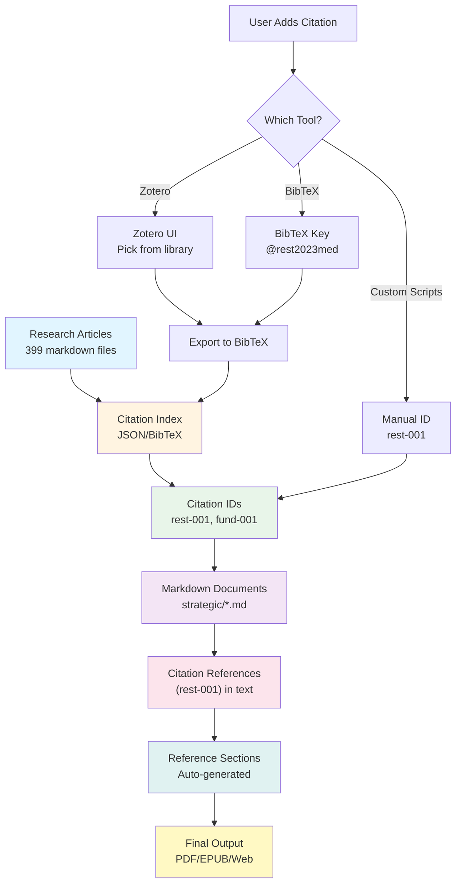

**Real-world example:**
- You have an article about "Mediterranean Forest Restoration" saved as a markdown file
- A script reads it and assigns ID `rest-001`
- You write: "Forest restoration can increase biodiversity [rest-001]"
- A script scans your document, finds `[rest-001]`, looks up the article details, and adds to References section:
  - "rest-001: Mediterranean Forest Restoration (2023). Author et al. URL: ..."

---

## 🏗️ Architecture Option 1: Custom Scripts (Lightweight)

**Best for:** Quick start, full control, GitHub-native

**What this approach means:** You write JavaScript/Node.js scripts that read your article files, create a citation database, and automatically add reference sections to your documents. Everything stays in your GitHub repository as code and JSON files.

### Process Flow

**What this diagram shows:** The step-by-step process of how custom scripts handle citations, from reading articles to generating final documents.

**Left side - Building the citation index:**
1. **Article Files** → Your 399 markdown files in `research/bookmarks/articles/` folder
2. **Script: generate-citation-index.js** → You run this script once. It:
   - Reads all article markdown files
   - Extracts title, author, URL, date from YAML frontmatter
   - Assigns sequential IDs: `rest-001`, `rest-002`, `fund-001`, etc.
   - Groups by category (restoration, funding, etc.)
3. **Citation Index** → Creates `citation_index.json` file with all citation data
4. **Citation IDs** → You now have a list of IDs you can use: `rest-001`, `fund-001`, etc.

**Right side - Using citations in documents:**
1. **User Writes Document** → You write your strategic guide markdown file
2. **Add Citation** → When you mention a fact, you type `[rest-001]` in your text
3. **Script: generate-references.js** → You run this script. It:
   - Scans your document for all `[citation-id]` patterns
   - Looks up each ID in `citation_index.json`
   - Finds the article details (title, author, URL)
   - Adds a "References" section at the end of your document
4. **Reference Section** → Your document now has a formatted references list

**Bottom - Export:**
- **Export to PDF/EPUB** → You use Pandoc to convert markdown to PDF
- **Pandoc** → Pandoc doesn't process citations (unlike Zotero approach), it just converts the markdown as-is, including your manually formatted references

**The lookup loop:**
- **Citation Lookup** → Helper script lets you search citations by topic/tag to find the right ID
- This helps you when you don't remember if it's `rest-001` or `rest-042`

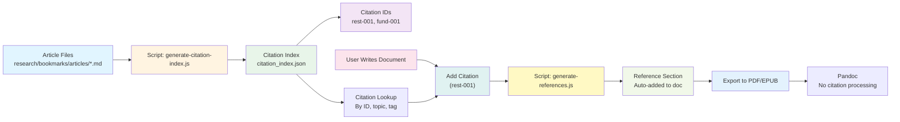

**Example workflow:**
1. Run `node scripts/generate-citation-index.js` → Creates `citation_index.json`
2. Write document: "Forest restoration increases biodiversity [rest-001]"
3. Run `node scripts/generate-references.js strategic/20a_Restoration_Methods_Guide.md`
4. Script adds at end: `## References\n\n- rest-001: Mediterranean Forest Restoration...`
5. Export with Pandoc → PDF includes the references

### System Architecture

**What this diagram shows:** The file structure and how all the components connect together in the Custom Scripts approach.

**Research Repository (top-left):**
- **Articles** → Your 399 markdown files, each with YAML frontmatter containing title, author, URL, date, tags
- These are your source of truth for research

**Citation System (top-center):**
- **generate-citation-index.js** → The main script that reads all articles and creates the index
- **Citation Index (JSON)** → `citation_index.json` - a structured data file that scripts can read programmatically
- **CITATIONS.md** → A human-readable markdown file listing all citations (for browsing/searching)

**Documentation (center):**
- **Strategic Docs** → Your actual documentation files like `strategic/20a_Restoration_Methods_Guide.md`
- **Citation References** → The `[rest-001]` markers you add in your text
- **Reference Sections** → The formatted list of references that gets added automatically

**Tools (bottom-left):**
- **add-citation.js** → Helper script to search for citations by topic/keyword and get the right ID
  - Example: `node scripts/add-citation.js "forest restoration"` → returns `rest-001`
- **generate-references.js** → The script that scans your document and adds the references section

**Export (bottom-right):**
- **Pandoc** → Converts your markdown to PDF/EPUB
- **No citation processing** → Pandoc doesn't format citations automatically (unlike Zotero approach), it just includes whatever you wrote

**How data flows:**
- Articles → Script reads them → Creates JSON index
- JSON index → Helper script uses it → Helps you find citation IDs
- You add citations to document → Reference script reads document → Adds formatted references
- Document with references → Pandoc → Final PDF/EPUB

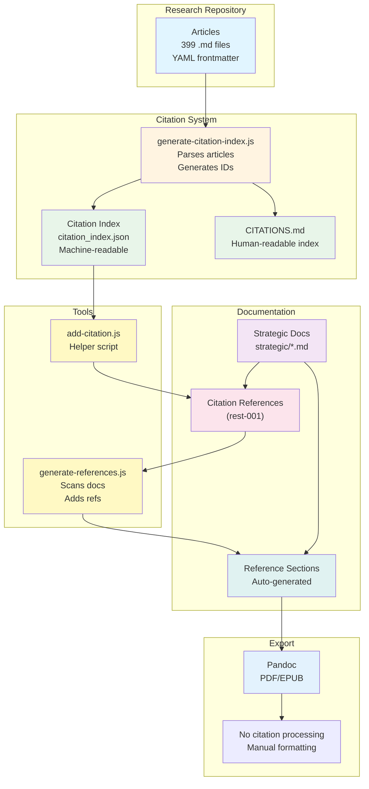

**File structure example:**
```
research/
  bookmarks/
    articles/
      restoration-001.md  ← Your articles
      funding-001.md
      ...
scripts/
  generate-citation-index.js  ← Creates index
  add-citation.js             ← Helper to find IDs
  generate-references.js      ← Adds refs to docs
citation_index.json           ← Generated index
CITATIONS.md                  ← Human-readable list
strategic/
  20a_Restoration_Methods_Guide.md  ← Your docs with [rest-001]
```

### What Each Component Does

| Component | Purpose | Input | Output |
|-----------|---------|-------|--------|
| **Article Files** | Source of research | Markdown with YAML | - |
| **generate-citation-index.js** | Parse articles, create IDs | Article files | `citation_index.json` |
| **citation_index.json** | Machine-readable index | - | Citation data |
| **CITATIONS.md** | Human-readable index | - | Browseable list |
| **add-citation.js** | Helper to find/add citations | Topic/keywords | Citation ID |
| **generate-references.js** | Scan docs, add ref sections | Markdown files | Updated files |
| **Pandoc** | Export to PDF/EPUB | Markdown | PDF/EPUB |

---

## 🏗️ Architecture Option 2: Zotero + Pandoc

**Best for:** Academic-style citations, automatic formatting

**What this approach means:** You use Zotero (a desktop app) to manage your research articles. Zotero has a browser extension that lets you save articles with one click. You export your Zotero library to BibTeX format, then Pandoc automatically formats citations in academic styles (APA, MLA, Chicago, etc.).

**Key difference from Custom Scripts:** Pandoc does the citation formatting automatically - you don't need to write scripts to generate reference sections. Pandoc reads your BibTeX file and formats citations according to a style file.

### Process Flow

**What this diagram shows:** How Zotero captures articles, how you export them, and how Pandoc automatically formats citations.

**Top section - Capturing and organizing articles:**
1. **Research Articles** → You find articles on the web (or have PDFs)
2. **Zotero Browser Extension** → You install a browser extension. When you visit an article page, you click the Zotero button and it automatically saves:
   - Title, author, date, URL
   - Sometimes the full PDF
   - Metadata from the webpage
3. **Zotero Library** → All articles are stored in Zotero desktop app where you can:
   - Organize into folders (collections)
   - Add tags
   - Add notes
   - Search and filter
4. **Export to BibTeX** → You export your entire library (or a collection) to `references.bib` file
5. **Citation Keys** → Each article gets a BibTeX key like `@rest2023mediterranean` (author + year + keyword)

**Bottom section - Using citations:**
1. **User Writes Document** → You write your markdown file
2. **Add Citation** → You type `[@rest2023mediterranean]` in your text (the BibTeX key)
3. **Pandoc with --citeproc** → When you run Pandoc to export, you add the `--citeproc` flag. Pandoc:
   - Reads all `[@key]` citations in your document
   - Looks them up in `references.bib`
   - Formats them according to a CSL style file (APA, MLA, etc.)
   - Replaces `[@key]` with formatted citations like "(Smith et al., 2023)"
   - Generates a formatted References section automatically
4. **Formatted References** → Your PDF/EPUB has properly formatted academic citations

**Optional automation:**
- **Zotero API** → You can set up scripts to automatically export BibTeX when Zotero library changes (advanced)

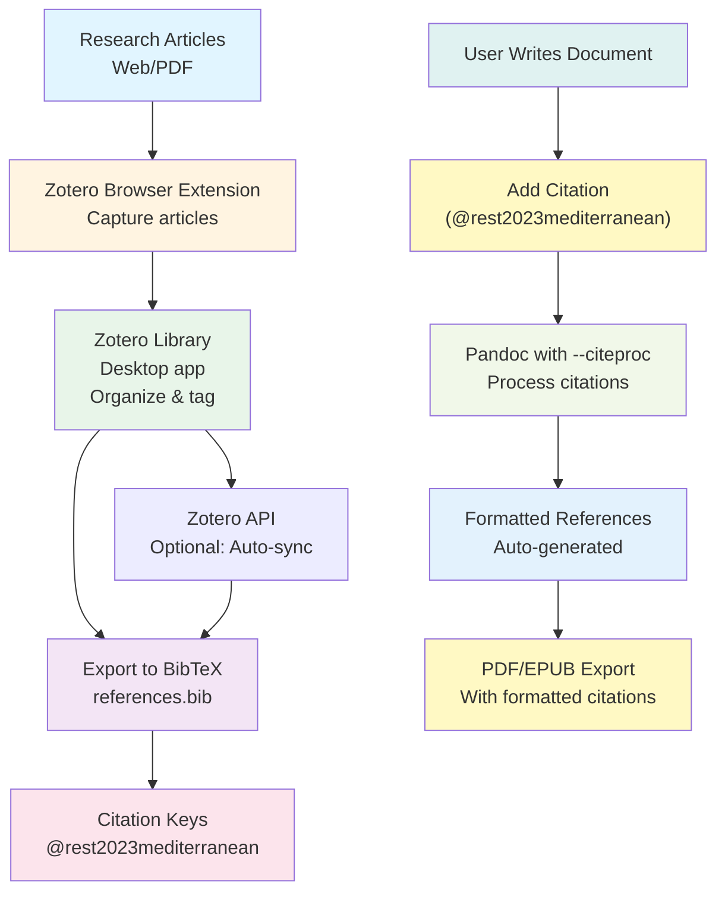

**Example workflow:**
1. Visit article webpage → Click Zotero extension → Article saved to library
2. In Zotero: Organize into "Restoration" collection, add tag "biodiversity"
3. Export: File → Export Library → BibTeX → Save as `references.bib`
4. Write document: "Forest restoration increases biodiversity [@rest2023mediterranean]"
5. Run: `pandoc document.md --citeproc --bibliography=references.bib --csl=apa.csl -o document.pdf`
6. Pandoc automatically formats: "(Smith et al., 2023)" in text and adds formatted References section

### System Architecture

**What this diagram shows:** The components of the Zotero + Pandoc system and how they connect.

**Article Capture (top-left):**
- **Web Browser** → You browse the web for research articles
- **Zotero Connector** → Browser extension (Chrome, Firefox, Safari) that captures article metadata
- **Zotero Desktop** → Desktop application (Windows/Mac/Linux) that stores and manages your library

**Citation Management (top-center):**
- **Organize & Tag** → In Zotero desktop, you create collections (folders) and add tags to organize articles
- **Export BibTeX** → You export your library to `references.bib` - a text file in BibTeX format (academic standard)

**Documentation (center):**
- **Markdown Files** → Your documentation files
- **Pandoc Citations** → You use `[@key]` syntax where `key` is the BibTeX key from your library

**Processing (bottom-center):**
- **Pandoc** → The conversion tool. When you add `--citeproc` flag, it processes citations:
  - `--bibliography=references.bib` tells Pandoc where to find citation data
  - `--csl=apa.csl` tells Pandoc which citation style to use (APA, MLA, Chicago, etc.)
- **CSL Style** → Citation Style Language file that defines how citations look (e.g., APA format: "Author (Year)")

**Output (bottom-right):**
- **PDF/EPUB with Citations** → Final documents with properly formatted in-text citations and reference sections

**How it works:**
- Zotero manages articles (like a personal library database)
- BibTeX is the bridge format (Zotero → BibTeX → Pandoc)
- Pandoc does the heavy lifting (formatting citations automatically)
- CSL styles control the appearance (APA vs MLA vs Chicago, etc.)

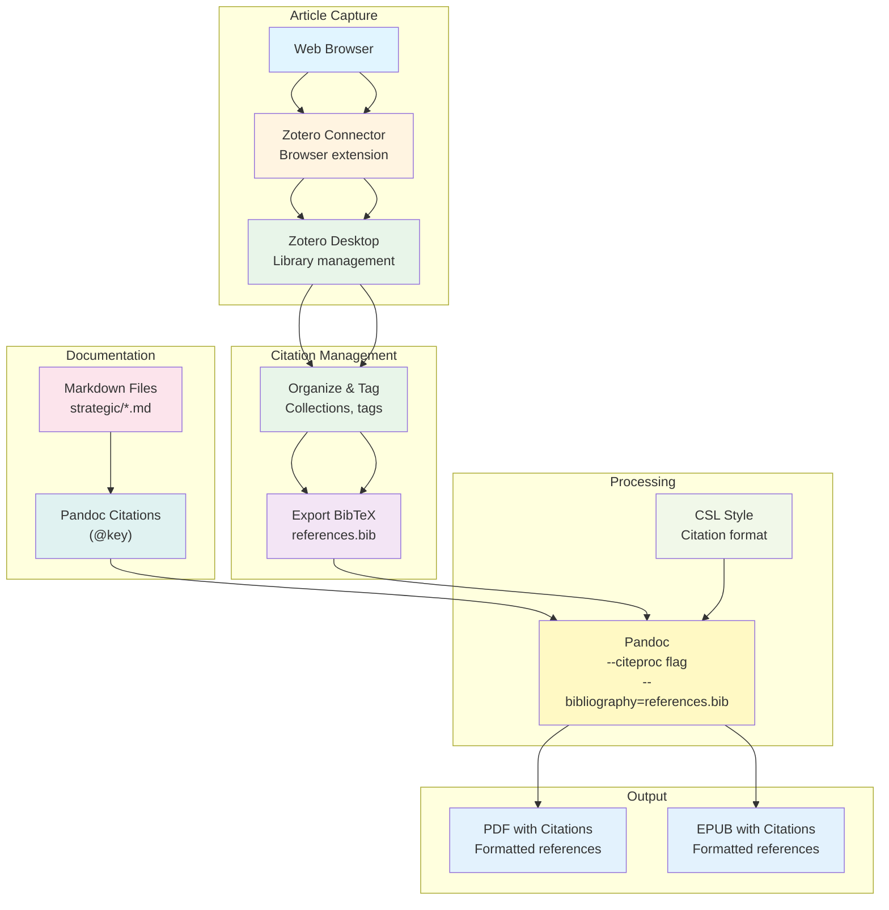

### What Each Component Does

| Component | Purpose | Input | Output |
|-----------|---------|-------|--------|
| **Zotero Connector** | Capture articles from web | Web pages | Zotero items |
| **Zotero Desktop** | Manage library, organize | Articles | Organized library |
| **BibTeX Export** | Convert to standard format | Zotero library | `references.bib` |
| **Pandoc --citeproc** | Process citations | Markdown + BibTeX | Formatted citations |
| **CSL Style** | Citation format | Style file | Formatted output |

---

## 🏗️ Architecture Option 3: BibTeX/BibLaTeX (Academic Standard)

**Best for:** Academic publications, formal citations

**What this approach means:** You skip Zotero and work directly with BibTeX files. You manually create or import entries into a `references.bib` file. This is the most "academic" approach - it's what LaTeX users have been doing for decades. You have full control but more manual work.

**Key difference:** No Zotero app - you edit BibTeX files directly (or use scripts to import from your markdown articles).

### Process Flow

**What this diagram shows:** The direct BibTeX workflow without Zotero as an intermediary.

**Left side - Creating the bibliography:**
1. **Research Articles** → You have articles (web, PDF, markdown)
2. **Manual Entry or Import** → You either:
   - Manually type BibTeX entries into `references.bib` file
   - Use a script to convert your markdown articles to BibTeX format
   - Import from other sources
3. **BibTeX File** → `references.bib` contains entries like:
   ```
   @article{rest2023mediterranean,
     title={Mediterranean Forest Restoration},
     author={Smith, John and Doe, Jane},
     year={2023},
     journal={Ecology Today}
   }
   ```
4. **Citation Keys** → Each entry has a key (like `rest2023mediterranean`) that you use in citations

**Right side - Using citations:**
1. **Markdown Document** → You write your document
2. **Add Citation** → You type `[@rest2023mediterranean]` in your text
3. **Pandoc** → You run Pandoc with:
   - `--citeproc` (process citations)
   - `--bibliography=references.bib` (where to find citations)
   - `--csl=apa.csl` (which style to use)
4. **Formatted Citations** → Pandoc automatically:
   - Replaces `[@key]` with formatted citations
   - Generates References section
5. **PDF/EPUB** → Final document with formatted citations

**When to use this:** If you prefer text files over GUI apps, or if you're already familiar with BibTeX/LaTeX.

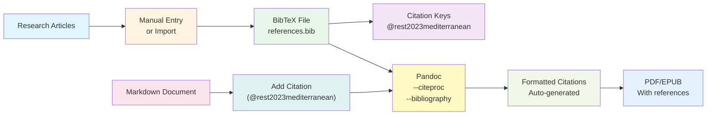

**Example workflow:**
1. Create `references.bib` file manually or import from markdown articles
2. Write document: "Forest restoration increases biodiversity [@rest2023mediterranean]"
3. Run: `pandoc document.md --citeproc --bibliography=references.bib --csl=apa.csl -o document.pdf`
4. Pandoc formats citations and generates References section automatically

### System Architecture

**What this diagram shows:** The components of a direct BibTeX system.

**BibTeX Database (top):**
- **references.bib** → A text file containing all your citations in BibTeX format
- **Version controlled** → Since it's a text file, you can commit it to Git
- **Text-based** → You can edit it with any text editor

**Citation Entry (top-center):**
- **Manual Entry or Script Import** → You create BibTeX entries either:
  - By hand (typing the BibTeX syntax)
  - Via script (converting from markdown articles)
- **Citation Keys** → Each entry has a unique key (like `rest2023mediterranean`) in `@key` format

**Documentation (center):**
- **Markdown Files** → Your documentation
- **(@key) syntax** → You use `[@key]` to cite articles

**Processing (bottom-center):**
- **Pandoc** → Converts markdown and processes citations
- **CSL Style File** → Defines citation format (APA, MLA, Chicago, etc.)

**Output (bottom):**
- **PDF/EPUB** → Final documents with formatted citations

**Advantages:**
- Simple: Just a text file
- Version control friendly
- No external app needed
- Works with any editor

**Disadvantages:**
- More manual work (no browser extension)
- Need to learn BibTeX syntax
- No visual library management

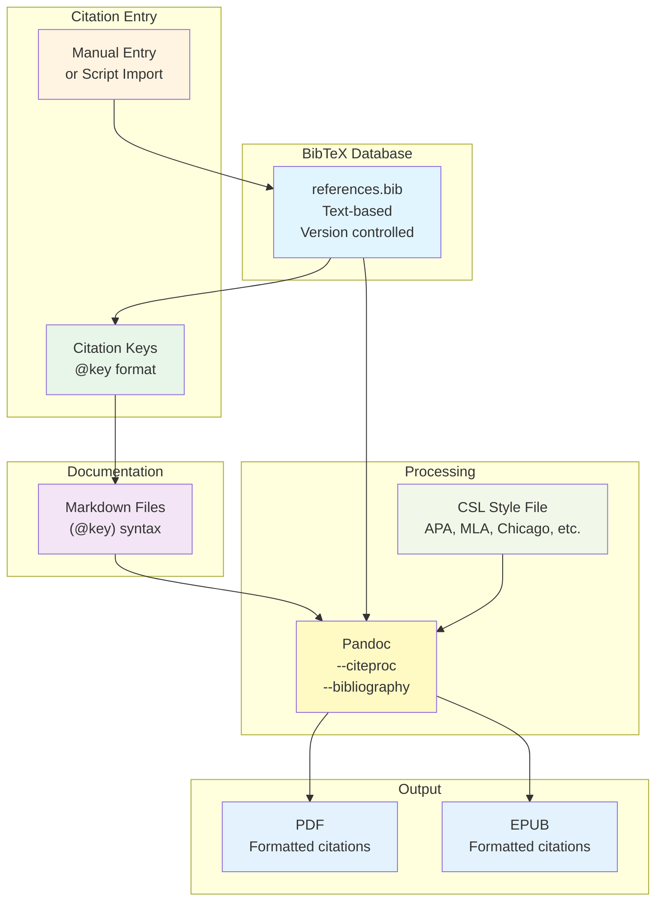

---

## 🏗️ Architecture Option 3.5: Automated API-Driven (Zotero API + Source Extraction) ⚡

**Best for:** Fully automated workflow, AI-generated content integration, server-based management

**What this approach means:** You use Zotero's REST API (or a self-hosted alternative) to manage your citation database programmatically. When AI tools like Perplexity generate markdown with numbered citations `[1]`, `[2]`, you automatically extract those sources and import them into Zotero via API. When you edit documents and remove paragraphs, a script automatically cleans up unused references.

**Key advantages:**
- ✅ Fully automated - no manual Zotero GUI needed
- ✅ Works with AI-generated content (Perplexity, Claude, etc.)
- ✅ Server-based - can run on any machine with API access
- ✅ Automatic reference cleanup when content is removed
- ✅ Button/script-based workflow - one click to process

**Requirements:**
- Zotero account with API key (or self-hosted Zotero server)
- Scripts to extract sources from markdown
- Scripts to import sources via Zotero API
- Scripts to clean up unused references

### Process Flow

**What this diagram shows:** The automated workflow from AI-generated markdown to cleaned, properly cited documents with sources automatically imported to Zotero.

**Top section - AI content processing:**
1. **AI Tool (Perplexity/Claude)** → Generates markdown with numbered citations like:
   ```markdown
   Forest restoration increases biodiversity [1].
   Native species have 85% success rate [2].
   
   [1] Source title, Author, 2023. URL: https://...
   [2] Another source, Author, 2024. URL: https://...
   ```
2. **Source Extraction Script** → Parses markdown and extracts:
   - Citation numbers `[1]`, `[2]`
   - Source details (title, author, URL, year)
   - Maps citations to sources
3. **Zotero API Import** → Script automatically:
   - Checks if source already exists (by URL or title)
   - Creates new Zotero item if not found
   - Gets Zotero item key for each source
   - Maps numbered citations to Zotero keys

**Middle section - Document editing:**
1. **User Edits Document** → You add/remove paragraphs with citations
2. **Reference Cleanup Script** → When you run cleanup (button/script):
   - Scans document for all citation numbers `[1]`, `[2]`, etc.
   - Finds corresponding sources at bottom
   - Removes sources that aren't cited anymore
   - Renumbers remaining citations sequentially
   - Updates citation numbers in text

**Bottom section - Final output:**
1. **Convert to BibTeX Keys** → Script converts numbered citations to BibTeX keys:
   - `[1]` → `[@zotero-key-1]`
   - `[2]` → `[@zotero-key-2]`
2. **Pandoc Processing** → Pandoc with `--citeproc` formats citations
3. **Final Document** → PDF/EPUB with properly formatted citations

```mermaid
flowchart TD
    A["AI Tool<br/>(Perplexity/Claude)<br/>Generates markdown with [1], [2]"] --> B[Source Extraction Script<br/>parse-sources.js]
    B --> C[Extract Sources<br/>Title, Author, URL, Year]
    C --> D[Zotero API<br/>Check if exists]
    D --> E{Source exists?}
    E -->|No| F[Create Zotero Item<br/>via API]
    E -->|Yes| G[Get Zotero Key]
    F --> G
    G --> H[Map Citations<br/>[1] → @zotero-key-1]
    
    I[User Edits Document<br/>Add/remove paragraphs] --> J[Reference Cleanup Script<br/>cleanup-references.js]
    J --> K[Scan for Citations<br/>Find all [1], [2], etc.]
    K --> L[Check Sources<br/>Which are still used?]
    L --> M[Remove Unused Sources<br/>Renumber remaining]
    M --> N[Update Citation Numbers<br/>In text and references]
    
    H --> O[Convert to BibTeX Keys<br/>[@zotero-key-1]"]
    N --> O
    O --> P[Pandoc --citeproc<br/>Format citations]
    P --> Q[Final Document<br/>PDF/EPUB with citations]
    
    style A fill:#e1f5ff
    style B fill:#fff4e1
    style C fill:#e8f5e9
    style D fill:#f3e5f5
    style E fill:#fce4ec
    style F fill:#e0f2f1
    style G fill:#fff9c4
    style H fill:#f1f8e9
    style I fill:#e3f2fd
    style J fill:#fff4e1
    style K fill:#e8f5e9
    style L fill:#f3e5f5
    style M fill:#fce4ec
    style N fill:#e0f2f1
    style O fill:#fff9c4
    style P fill:#f1f8e9
    style Q fill:#e3f2fd
```

**Example workflow:**
1. Perplexity generates: "Forest restoration [1] increases biodiversity [2]"
2. Run `node scripts/import-ai-sources.js document.md` → Extracts sources, imports to Zotero
3. Edit document: Remove paragraph with `[2]`
4. Run `node scripts/cleanup-references.js document.md` → Removes unused source, renumbers
5. Run `node scripts/convert-to-bibtex.js document.md` → Converts `[1]` to `[@zotero-key-1]`
6. Pandoc exports → Final PDF with formatted citations

### System Architecture

**What this diagram shows:** The components of the automated API-driven system, showing how scripts interact with Zotero API and process documents.

**AI Content Input (top-left):**
- **AI-Generated Markdown** → Content with numbered citations `[1]`, `[2]`
- **Source List** → Sources listed at bottom with details

**Source Processing (top-center):**
- **parse-sources.js** → Extracts sources from markdown:
  - Parses numbered citations `[1]`, `[2]`
  - Extracts source details (title, author, URL, year)
  - Handles various formats (URL, DOI, title-only, etc.)
- **Zotero API Client** → Communicates with Zotero:
  - `GET /items` - Search for existing items
  - `POST /items` - Create new items
  - `GET /items/{key}` - Get item details
  - Uses API key for authentication

**Zotero Server (center):**
- **Zotero API** → REST API endpoint (zotero.org or self-hosted)
- **Zotero Database** → Stores all your sources
- **Item Keys** → Unique identifiers for each source

**Document Processing (center-right):**
- **Markdown Documents** → Your documents with numbered citations
- **cleanup-references.js** → Cleans up references:
  - Scans document for all citation numbers
  - Identifies which sources are still used
  - Removes unused sources
  - Renumbers citations sequentially
- **convert-to-bibtex.js** → Converts numbered to BibTeX format

**Export (bottom):**
- **Pandoc** → Processes citations and generates formatted output
- **Final Documents** → PDF/EPUB with properly formatted citations

**Automation Layer:**
- **Button/CLI Interface** → One-click processing:
  - `import-sources` - Import sources from AI content
  - `cleanup-refs` - Clean up unused references
  - `process-all` - Do both in sequence

```mermaid
graph TB
    subgraph "AI Content Input"
        A["AI-Generated Markdown<br/>[1], [2] citations<br/>Sources at bottom"]
    end
    
    subgraph "Source Processing"
        B[parse-sources.js<br/>Extract sources<br/>Parse citations]
        C[Zotero API Client<br/>HTTP requests<br/>Authentication]
    end
    
    subgraph "Zotero Server"
        D[Zotero REST API<br/>zotero.org or<br/>self-hosted]
        E[Zotero Database<br/>All sources<br/>Item keys]
    end
    
    subgraph "Document Processing"
        F[Markdown Documents<br/>With numbered citations]
        G[cleanup-references.js<br/>Remove unused<br/>Renumber]
        H[convert-to-bibtex.js<br/>[1] → @key]
    end
    
    subgraph "Export"
        I[Pandoc<br/>--citeproc]
        J[Final Documents<br/>PDF/EPUB]
    end
    
    subgraph "Automation"
        K[Button/CLI<br/>import-sources<br/>cleanup-refs<br/>process-all]
    end
    
    A --> B
    B --> C
    C --> D
    D --> E
    E --> C
    C --> B
    B --> F
    F --> G
    G --> H
    H --> I
    I --> J
    K --> B
    K --> G
    
    style A fill:#e1f5ff
    style B fill:#fff4e1
    style C fill:#e8f5e9
    style D fill:#f3e5f5
    style E fill:#fce4ec
    style F fill:#e0f2f1
    style G fill:#fff9c4
    style H fill:#f1f8e9
    style I fill:#e3f2fd
    style J fill:#fff9c4
    style K fill:#fce4ec
```

### Implementation Details

**1. Source Extraction Script (`parse-sources.js`)**

**What it does:**
- Parses markdown to find numbered citations `[1]`, `[2]`, etc.
- Extracts source list at bottom (various formats):
  ```markdown
  [1] Title, Author, 2023. URL: https://...
  [2] Another Title. Author et al. 2024. https://...
  ```
- Extracts: title, author(s), year, URL, DOI (if available)
- Maps citation numbers to source details

**Example input:**
```markdown
Forest restoration [1] increases biodiversity [2].

[1] Mediterranean Forest Restoration. Smith, J. 2023. https://example.com/restoration
[2] Biodiversity in Restored Ecosystems. Doe, J. et al. 2024. https://example.com/biodiversity
```

**Example output:**
```json
{
  "citations": {
    "1": {
      "title": "Mediterranean Forest Restoration",
      "author": "Smith, J.",
      "year": 2023,
      "url": "https://example.com/restoration"
    },
    "2": {
      "title": "Biodiversity in Restored Ecosystems",
      "author": "Doe, J. et al.",
      "year": 2024,
      "url": "https://example.com/biodiversity"
    }
  }
}
```

**2. Zotero API Import (`import-to-zotero.js`)**

**What it does:**
- For each extracted source:
  - Checks if source exists in Zotero (search by URL or title)
  - If not found, creates new Zotero item via API
  - Gets Zotero item key
  - Maps citation number to Zotero key

**Zotero API endpoints:**
- `GET /users/{userID}/items?q={query}` - Search items
- `POST /users/{userID}/items` - Create item
- `GET /users/{userID}/items/{itemKey}` - Get item details

**Example API call:**
```javascript
// Check if source exists
GET https://api.zotero.org/users/12345/items?q=url:https://example.com/restoration

// Create new item if not found
POST https://api.zotero.org/users/12345/items
{
  "itemType": "webpage",
  "title": "Mediterranean Forest Restoration",
  "creators": [{"creatorType": "author", "firstName": "J.", "lastName": "Smith"}],
  "date": "2023",
  "url": "https://example.com/restoration"
}
```

**3. Reference Cleanup Script (`cleanup-references.js`)**

**What it does:**
- Scans document for all citation numbers `[1]`, `[2]`, etc.
- Finds source list at bottom
- Identifies which sources are still cited
- Removes unused sources
- Renumbers citations sequentially (1, 2, 3...)
- Updates citation numbers in text

**Example:**
```markdown
# Before cleanup
Forest restoration [1] increases biodiversity [2].
Native species [3] are important.

[1] Source 1
[2] Source 2 (removed paragraph, this is unused)
[3] Source 3
```

```markdown
# After cleanup
Forest restoration [1] increases biodiversity.
Native species [2] are important.

[1] Source 1
[2] Source 3
```

**4. Button/CLI Interface**

**Options:**
- **VS Code Extension** → Button in editor toolbar
- **CLI Script** → `node scripts/process-document.js document.md`
- **GitHub Action** → Automatic processing on commit
- **Web Interface** → Simple HTML page with buttons

**Example CLI:**
```bash
# Import sources from AI content
node scripts/import-ai-sources.js document.md

# Clean up unused references
node scripts/cleanup-references.js document.md

# Do both
node scripts/process-document.js document.md --import --cleanup
```

### Zotero API Setup

**Option 1: Zotero.org API (Cloud)**
- Create account at zotero.org
- Generate API key: Settings → Feeds/API → Create new private key
- Use API endpoint: `https://api.zotero.org/users/{userID}/`
- Free tier: 30,000 requests/day

**Option 2: Self-Hosted Zotero Server**
- Install Zotero Server (open-source)
- Run on your own server
- Full control, no rate limits
- More setup required

**Option 3: Alternative: Custom Database**
- Build your own citation database
- Use SQLite/PostgreSQL
- Create REST API wrapper
- Maximum flexibility

### What Each Component Does

| Component | Purpose | Input | Output |
|-----------|---------|-------|--------|
| **parse-sources.js** | Extract sources from markdown | AI-generated markdown | Source list (JSON) |
| **Zotero API Client** | Communicate with Zotero | Source details | Zotero item keys |
| **import-to-zotero.js** | Import sources to Zotero | Source list | Zotero items created |
| **cleanup-references.js** | Remove unused references | Markdown with citations | Cleaned markdown |
| **convert-to-bibtex.js** | Convert numbered to BibTeX | Markdown with [1], [2] | Markdown with [@key] |
| **Pandoc** | Format citations | Markdown + BibTeX | PDF/EPUB |

---

## 🏗️ Architecture Option 4: Hybrid (Zotero → BibTeX → Custom Scripts) ⭐

**Best for:** Best of all worlds - recommended approach

**What this approach means:** You combine the best parts of all three approaches:
- Use Zotero for easy article capture and management (like Option 2)
- Export to BibTeX for Pandoc's automatic citation formatting (like Option 2)
- Also convert BibTeX to JSON for custom scripts (like Option 1)
- Result: You can use EITHER simple custom IDs `[rest-001]` OR academic BibTeX keys `[@rest2023med]` in the same document

**Key advantage:** Maximum flexibility - use simple citations for quick docs, academic citations for formal publications, or mix both.

### Process Flow

**What this diagram shows:** How the hybrid system combines Zotero, BibTeX, and custom scripts to give you both citation options.

**Top section - Article management (same as Zotero approach):**
1. **Research Articles** → You find articles on web/PDF/Raindrop
2. **Zotero** → You capture articles using Zotero browser extension (easy!)
3. **Zotero Library** → You organize articles in Zotero desktop app
4. **Export BibTeX** → You export to `references.bib` (for Pandoc)

**Middle section - Dual format creation:**
1. **Script: sync-bibtex-json.js** → A script converts BibTeX to JSON format
2. **Citation Index** → Creates `citation_index.json` (for custom scripts)
3. **Citation IDs** → You now have BOTH:
   - Custom IDs: `rest-001`, `fund-001` (simple, short)
   - BibTeX keys: `@rest2023med`, `@fund2023grant` (academic standard)

**Bottom section - Using citations (your choice!):**
1. **User Writes Document** → You write your document
2. **Citation Method** → You choose:
   - **Simple**: Use `[rest-001]` (custom ID) → Goes to custom script
   - **Pandoc**: Use `[@rest2023med]` (BibTeX key) → Goes to Pandoc
3. **Processing**:
   - Custom IDs → `generate-references.js` → Custom formatted references
   - BibTeX keys → `Pandoc --citeproc` → Academic formatted references
4. **Reference Sections** → Both methods generate reference sections (different formats)
5. **PDF/EPUB Export** → Final document with citations

**Why this is powerful:** You can use simple `[rest-001]` for internal docs and academic `[@rest2023med]` for publications, all from the same Zotero library!

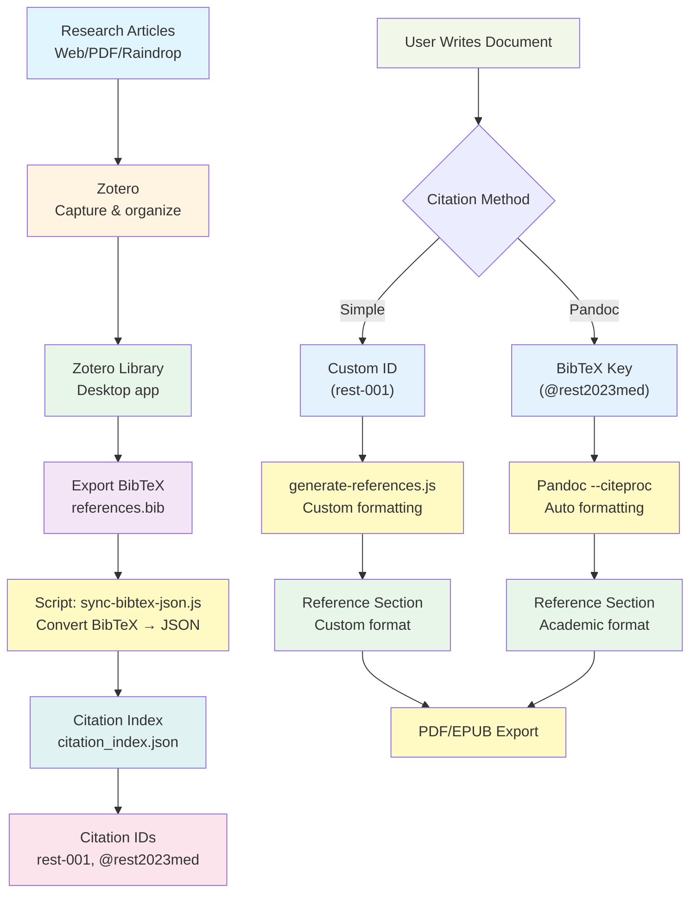

**Example workflow:**
1. Capture articles in Zotero → Export to `references.bib`
2. Run `node scripts/sync-bibtex-json.js` → Creates `citation_index.json`
3. Write document with mixed citations:
   - "Forest restoration [rest-001] increases biodiversity [@rest2023mediterranean]"
4. For custom IDs: Run `generate-references.js` → Adds custom references
5. For BibTeX: Run `pandoc --citeproc --bibliography=references.bib` → Formats academic citations
6. Final PDF has both citation styles!

### System Architecture

**What this diagram shows:** How all the components work together in the hybrid system, maintaining both BibTeX and JSON formats simultaneously.

**Article Management (top-left):**
- **Zotero Desktop** → Your main library management (GUI app)
- **Zotero Connector** → Browser extension for easy capture
- This is your primary interface for managing articles

**Citation Database (top-center):**
- **references.bib** → BibTeX format for Pandoc (academic citations)
- **citation_index.json** → JSON format for custom scripts (simple citations)
- Both files contain the same data, just different formats

**Sync Layer (center-left):**
- **sync-bibtex-json.js** → Converts BibTeX → JSON (one-way sync)
- **generate-citation-index.js** → Enhances JSON index (adds custom IDs like `rest-001`)
- This keeps both formats in sync

**Documentation (center):**
- **Markdown Files** → Your documents
- **Custom Citations** → You can use `[rest-001]` format
- **Pandoc Citations** → You can use `[@rest2023med]` format
- You can mix both in the same document!

**Processing (bottom-center):**
- **generate-references.js** → Processes custom IDs, generates custom-formatted references
- **Pandoc --citeproc** → Processes BibTeX keys, generates academic-formatted references
- Both can run on the same document (custom script first, then Pandoc)

**Output (bottom):**
- **PDF/EPUB** → Final documents with citations
- **Web Docs** → Custom citations work in web version too

**Data flow:**
- Zotero → BibTeX export → Sync script → JSON index
- JSON index → Custom scripts → Custom citations
- BibTeX file → Pandoc → Academic citations
- Both formats stay in sync automatically

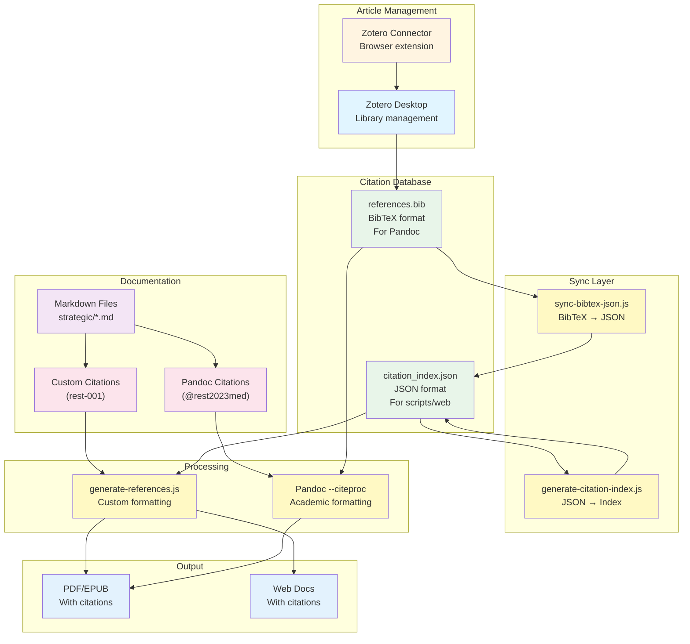

### What Each Component Does

| Component | Purpose | Input | Output |
|-----------|---------|-------|--------|
| **Zotero Desktop** | Manage research library | Articles | Organized library |
| **Export BibTeX** | Convert to standard format | Zotero library | `references.bib` |
| **sync-bibtex-json.js** | Convert BibTeX → JSON | BibTeX file | JSON index |
| **citation_index.json** | Machine-readable index | - | Citation data |
| **generate-references.js** | Custom citation formatting | Markdown + JSON | Reference sections |
| **Pandoc --citeproc** | Academic citation formatting | Markdown + BibTeX | Formatted citations |

---

## 🔄 Complete Workflow Comparison

**What these diagrams show:** Step-by-step interactions between you and the tools, showing the exact sequence of operations for each approach. These are like "user stories" - what happens when you actually use each system.

### Custom Scripts Workflow

**What this sequence shows:** The chronological steps of using custom scripts, from initial setup to final PDF export.

**Participants:**
- **User** → You
- **Scripts** → Your JavaScript scripts
- **Articles** → Your 399 markdown article files
- **Index** → The `citation_index.json` file
- **Documents** → Your documentation markdown files
- **Pandoc** → The PDF/EPUB converter

**The flow:**
1. You have 399 articles already
2. You run the index generation script
3. Script reads articles and creates the index
4. Index gives you citation IDs
5. You add citations to your document
6. You run the reference generation script
7. Script scans document, looks up citations, adds references
8. You export with Pandoc
9. You get PDF with references

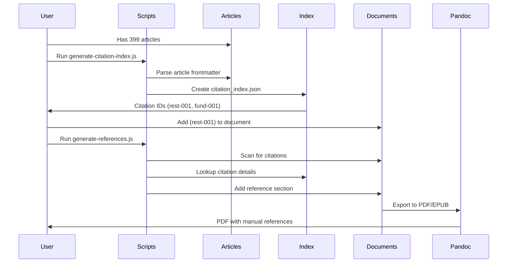

### Zotero Workflow

**What this sequence shows:** How Zotero simplifies the workflow - you manage articles in a GUI app, export once, and Pandoc handles all citation formatting automatically.

**Participants:**
- **User** → You
- **Zotero** → Zotero desktop application
- **BibTeX** → The `references.bib` file
- **Documents** → Your documentation markdown files
- **Pandoc** → The PDF/EPUB converter with citation processing

**The flow:**
1. You import articles into Zotero (via browser extension or manual entry)
2. Zotero helps you organize and tag articles (visual interface)
3. You export your library to BibTeX format
4. Zotero generates the BibTeX file
5. You add citations to your document using BibTeX keys
6. You run Pandoc with citation processing enabled
7. Pandoc reads the BibTeX file
8. Pandoc processes all citations and formats them
9. You get PDF with automatically formatted academic citations

**Key difference:** Pandoc does all the citation formatting - you don't need to write scripts!

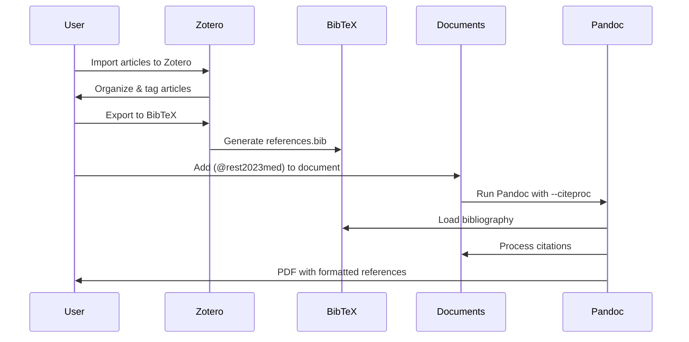

### Hybrid Workflow

**What this sequence shows:** How the hybrid approach gives you both options - you can use simple custom IDs OR academic BibTeX keys, all from the same Zotero library.

**Participants:**
- **User** → You
- **Zotero** → Zotero desktop application
- **BibTeX** → The `references.bib` file
- **Scripts** → Your JavaScript scripts
- **JSON Index** → The `citation_index.json` file
- **Documents** → Your documentation markdown files
- **Pandoc** → The PDF/EPUB converter with citation processing

**The flow:**
1. You import articles into Zotero (easy capture)
2. Zotero exports to BibTeX (for Pandoc)
3. A script converts BibTeX to JSON (for custom scripts)
4. Script creates the JSON index (with custom IDs)
5. You add citations - you can use EITHER format:
   - Custom ID: `[rest-001]` → Goes to custom script
   - BibTeX key: `[@rest2023med]` → Goes to Pandoc
6. Two processing paths:
   - Custom script looks up in JSON index and adds custom references
   - Pandoc looks up in BibTeX file and formats academic citations
7. Both processes update your document
8. You get PDF with both citation styles!

**Why this is powerful:** One Zotero library, two citation formats, maximum flexibility.

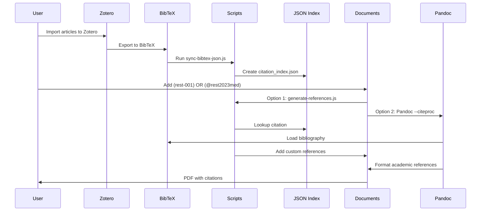

---

## 📊 Tool Responsibilities Matrix

| Task | Custom Scripts | Zotero | BibTeX | Pandoc |
|------|---------------|--------|--------|--------|
| **Article Capture** | Manual/Import | ✅ Browser extension | Manual entry | ❌ |
| **Library Management** | JSON file | ✅ Desktop app | Text file | ❌ |
| **Citation IDs** | Custom (rest-001) | BibTeX keys | BibTeX keys | Processes keys |
| **Citation Formatting** | Manual/Custom | Via Pandoc | Via Pandoc | ✅ Automatic |
| **Reference Generation** | Script-based | Via Pandoc | Via Pandoc | ✅ Automatic |
| **PDF/EPUB Export** | Pandoc (no citations) | Pandoc (with citations) | Pandoc (with citations) | ✅ |
| **Version Control** | ✅ JSON files | ⚠️ Database files | ✅ Text files | ❌ |
| **Collaboration** | ✅ Git-based | ✅ Zotero Groups | ✅ Git-based | ❌ |

---

## 🎯 Key Differences Explained

### Custom Scripts
- **You manage:** Everything manually or via scripts
- **Citation format:** Simple `[rest-001]` in markdown
- **Reference format:** Custom, script-generated
- **Best for:** Quick start, full control

### Zotero
- **You manage:** Articles in Zotero app
- **Citation format:** `[@rest2023mediterranean]` (BibTeX key)
- **Reference format:** Automatic via Pandoc + CSL styles
- **Best for:** Academic citations, automatic formatting

### BibTeX
- **You manage:** Text file (`references.bib`)
- **Citation format:** `[@rest2023mediterranean]` (BibTeX key)
- **Reference format:** Automatic via Pandoc + CSL styles
- **Best for:** Academic publications, version control

### Hybrid
- **You manage:** Articles in Zotero, sync to both formats
- **Citation format:** Either `[rest-001]` OR `[@rest2023med]`
- **Reference format:** Custom OR automatic (your choice)
- **Best for:** Flexibility, best of all worlds

---

## 💡 Which Should You Choose?

**Start with Custom Scripts if:**
- ✅ You want to start quickly (2-3 hours)
- ✅ You prefer GitHub-native solutions
- ✅ You don't need academic citation formatting yet
- ✅ You want full control

**Add Zotero later if:**
- ✅ You have 100+ citations to manage
- ✅ You need automatic citation formatting
- ✅ You want browser extension for easy capture
- ✅ You need collaborative features

**Use Hybrid approach if:**
- ✅ You want the best of both worlds
- ✅ You need flexibility (custom OR academic formatting)
- ✅ You're willing to invest 5-7 hours initially
- ✅ You want to future-proof your system

---

This document provides visual explanations of how each citation system works. The Mermaid diagrams show the flow of data and the responsibilities of each component.

